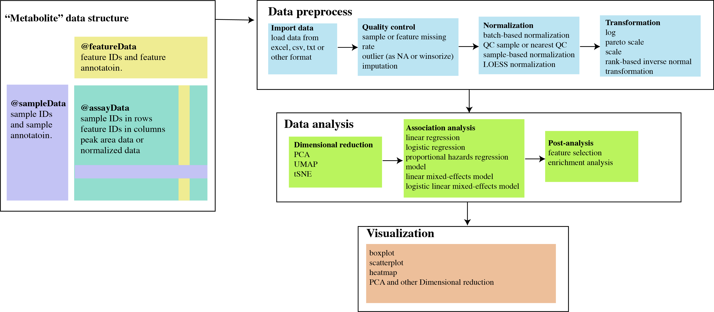

  <!-- README.md is generated from README.Rmd. Please edit that file -->
  


```{r, echo=FALSE, warning=FALSE, message=FALSE}


knitr::opts_chunk$set(
  collapse = TRUE,
  dpi = 300, ## change to 300 once on CRAN
  warning = FALSE,
  message = FALSE,
  out.width = "100%",
  comment = "#>",
  fig.path = "man/figures/README-",
  time_it = TRUE
)

library("metabolomicsR")

```

### `{metabolomicsR}` Tools to process, analyze, and visualize metabolomic data. 

`{metabolomicsR}` is a streamlined R package to preprocess, analyze, and visualize metabolomics data. We included broad utility functions for sample and metabolite quality control, outlier detection, missing value imputation, dimensional reduction, normalization, data integration, regression, metabolite annotation, enrichment analysis, and visualization of data and results. The `{metabolomicsR}` is designed to be a comprehensive R package that can be easily used by researchers with basic R programming skills. The framework designed here is versatile and is extensible to other various methods. Here, we demonstrate the step-by-step use of the main functions from this package. 


##### Seamless workflow to preprocess, analyze, and visualize metabolomics data in `{metabolomicsR}` 


## Installation

Type | Source | Command
---|---|---
Development | [](https://www.repostatus.org/##active) | `remotes::install_github("XikunHan/metabolomicsR")`


## Data structure

We first designed a “Metabolite” class based on the object-oriented programming system S4 in R. For a particular “Metabolite” data, it will include “assayData” (eg. peak area data or batch-normalized data, samples in rows and metabolites in columns), “featureData” (metabolite annotation), “sampleData” (sample annotation), “featureID”, “sampleID”, “logs” (log information of data analysis process), and “miscData” (other ancillary data). 


## Import data

To demonstrate the package, we obtained the data from the Qatar Metabolomics Study on Diabetes, similar to the data format from non-targeted mass spectrometry by Metabolon. The dataset is also available via [figshare](https://doi.org/10.6084/m9.figshare.5904022).


In the “assayData”, the first column is the sample IDs to match with “sampleData”, the other columns are metabolite IDs to match with “featureData”. 


```{r}
# Load the dataset

file_path <- system.file("extdata", "QMDiab_metabolomics_OrigScale.xlsx", package = "metabolomicsR", mustWork = TRUE)

df_plasma <- load_excel(path = file_path,
                        data_sheet = 1,
                        feature_sheet = 4,
                        sample_sheet = 8,
                        sampleID = "QMDiab-ID",
                        featureID = "BIOCHEMICAL"
                        )

```

<details>
<summary>**click to show plasma data**</summary>
```{r}
df_plasma
```
</details>


```{r}
# change the feature ID to the column `COMP_IDstr`
df_plasma <- update_Metabolite(df_plasma, dataset = "COMP_IDstr", action = "change_featureID")

```

<details>
<summary>**click to show plasma data**</summary>
```{r}
df_plasma
```
</details>


```{r}
# load urine metabolomic data
df_urine <- load_excel(path = file_path,
                        data_sheet = 2,
                        feature_sheet = 5,
                        sample_sheet = 9,
                        sampleID = "QMDiab-ID",
                        featureID = "BIOCHEMICAL"
                        )
df_urine <- update_Metabolite(df_urine, dataset = "COMP_IDstr", action = "change_featureID")
```

<details>
<summary>**click to show urine data**</summary>
```{r}
df_urine
```
</details>


```{r}
# load saliva metatabolomic data
df_saliva <- load_excel(path = file_path,
                        data_sheet = 3,
                        feature_sheet = 6,
                        sample_sheet = 10,
                        sampleID = "QMDiab-ID",
                        featureID = "BIOCHEMICAL"
                        )

df_saliva <- update_Metabolite(df_saliva, dataset = "COMP_IDstr", action = "change_featureID")
```


<details>
<summary>**click to show saliva data**</summary>
```{r}
df_saliva
```
</details>


##  Quality control pipeline

We provided a pipeline for metabolite and sample quality control (QC) procedures with a series of functions.
In the QC pipeline, we included the following functions: remove metabolites or samples beyond a particular missing rate threshold (eg. 0.5), detect outliers (eg. +- 5 SD) and replace outliers with NA or winsorize outliers, and popular methods to impute missing values (eg. half of the minimum value). All the steps can be customized to implement in the “QC_pipeline” function or be used from the individual functions (eg. “filter_column_missing_rate”, “replace_outlier”, and “impute”).


```{r}
df_plasma_QC <- QC_pipeline(df_plasma, impute_method = NULL)
```

<details>
<summary>**click to show plasma data after QC**</summary>
```{r}
df_plasma_QC
```
</details>


```{r}
df_urine_QC <- QC_pipeline(df_urine, impute_method = NULL)
```

<details>
<summary>**click to show urine data after QC**</summary>
```{r}
df_urine_QC
```
</details>


```{r}

df_saliva_QC <- QC_pipeline(df_saliva, impute_method = NULL)
```

<details>
<summary>**click to show saliva data after QC**</summary>
```{r}
df_saliva_QC
```
</details>

## Boxplot

```{r,  fig.width = 12, fig.height = 7}
# if no features were selected, randomly show 16 metabolites
plot_Metabolite(df_plasma_QC, plot = "boxplot", x = "T2D", color ="ETHNICITY", shape = "T2D")

```

```{r, fig.width = 12, fig.height = 6}
# select three metabolites
plot_Metabolite(df_plasma_QC, x = "T2D", plot = "boxplot",  feature_name = c("M43027",  "M11953", "M38002"))
```

```{r, fig.width = 12, fig.height = 7}
# comparisons between groups with ggbetweenstats
plot_Metabolite(df_plasma_QC, x = "T2D", plot = "betweenstats",  feature_name = c("M43027",  "M11953", "M38002"))

```


## Transformation

Transformation of metabolites can alter the distribution of data and is an essential step for the following statistical analysis. We provided the following transformation methods: log (natural logarithm), pareto scale, scale, and rank-based inverse normal transformation.
```{r}
df_plasma_QC <- impute(df_plasma_QC, method = "half-min")
df_plasma_scale <-  transformation(df_plasma_QC, method = "log")
df_plasma_scale <-  transformation(df_plasma_scale, method = "scale")
```


<details>
<summary>**click to show plasma data after scaling**</summary>
```{r}
df_plasma_scale
```
</details>


```{r, fig.width = 12, fig.height = 7}
plot_Metabolite(df_plasma_scale, plot = "boxplot", x = "T2D", color ="ETHNICITY", shape = "T2D")

```


## Dimensional reduction

Dimensional reduction strategies on metabolites data can be used to detect batch effects, sample outliers, and real biological subgroups. We included principal components analysis (PCA), manifold approximation and projection (UMAP), and t-distributed stochastic neighbor embedding (tSNE) methods. Figures will be displayed in ggplot2 style.
```{r}
df_plasma_PCA <- run_PCA(df_plasma_QC)
# df_plasma_PCA

plot_PCA(df_plasma_PCA, color ="ETHNICITY", shape = "T2D")

plot_UMAP(df_plasma_QC, color ="ETHNICITY", shape = "T2D")

plot_tsne(df_plasma_QC, color ="ETHNICITY", shape = "T2D")

```

## Association analysis 1: linear regression
Association analysis between metabolites and interested outcomes was implemented in the “regression” function, supporting general linear regression, logistic regression, poisson regression, proportional hazards regression model, linear mixed-effects model, and logistic linear mixed-effects model, with or without covariates. All the regression models can be run for selected metabolites or all metabolites in a single job with the support of parallel computing.

```{r}
fit_lm <- regression(object = df_plasma_scale, phenoData = NULL, model = "lm", outcome = "BMI",
                          covars = c("AGE", "GENDER", "ETHNICITY"), factors = "ETHNICITY")

head(fit_lm)

```


```{r}

dd <- merge(fit_lm, df_plasma_scale@featureData, by.x = "term", by.y = "featureID")

dd[, sig := ifelse(p.value.adj < 0.1, 1, 0)]
plot_volcano(dd, color = NULL, label = "BIOCHEMICAL")

```


## Association analysis 2: logistic regression

```{r}

fit_glm <- regression(object = df_plasma_scale, phenoData = NULL, model = "logistic", outcome = "T2D",
                         covars = c("AGE","GENDER", "ETHNICITY"), factors = "ETHNICITY")


head(fit_glm)

```


```{r}

dd <- merge(fit_glm, df_plasma_scale@featureData, by.x = "term", by.y = "featureID")

dd[, sig := ifelse(p.value.adj < 0.1, 1, 0)]

plot_volcano(dd, label = "BIOCHEMICAL")

```


## Association analysis 3: multiple outcomes, using model = "auto"

```{r}

fit <- regression(object = df_plasma_scale, phenoData = NULL, model = "auto", outcome = c("BMI", "T2D"),
                         covars = c("AGE","GENDER", "ETHNICITY"), factors = "ETHNICITY")


head(fit)

```


```{r}

dd <- merge(fit, df_plasma_scale@featureData, by.x = "term", by.y = "featureID")

dd[, sig := ifelse(p.value.adj < 0.1, 1, 0)]
plot_volcano(dd, color = "outcome", label = "BIOCHEMICAL")

```


## Association analysis 4: extension to other regression models

We have provided various regression models in the `{metabolomicsR}` package. 
Here we show how to extend the `regression` function to other regression models.

```{r}

# for example, to fit a Negative Binomial Generalized Linear Model, we first define a `fit_glm.nb` function. 

library(MASS)

fit_glm.nb <- function(data = NULL, formula = NULL, keep = NULL) {
  v_var <- all.vars(formula)
  df <- data[, v_var, with = FALSE]
  fit <- tryCatch(
    do.call("glm.nb", args = list(data = df, formula = formula)),
    error = function(e) {
      cat(paste0("Failed to fit model: ", e), "\n")
    })
  if(inherits(fit, "glm")) {
    res  <- as.data.table(broom::tidy(fit))
    if(! is.null(keep)) res <- res[res$term %in% keep, ]
    res$n <- length(fit$residuals)
  } else {
    res <- list(estimate = NA)
  }
  return(res)
}


# the outcome 'toy_y' was only created to demonstrate the usage to extend regression models
dd <- sampleData(df_plasma_scale) 
dd[, toy_y := round(BMI, 0)]
sampleData(df_plasma_scale)  <- dd

fit <- regression(object = df_plasma_scale, phenoData = NULL, model = "glm.nb", outcome = "toy_y",
                         covars = c("AGE","GENDER", "ETHNICITY"), factors = "ETHNICITY")

head(fit)


```


```{r}
dd <- merge(fit, df_plasma_scale@featureData, by.x = "term", by.y = "featureID")
dd[, sig := ifelse(p.value.adj < 0.1, 1, 0)]
plot_volcano(dd, color = NULL, label = "BIOCHEMICAL")
```


<details>
<summary>**Session Info**</summary>
```{r}
sessionInfo()
```
</details>
