<!-- README.md is generated from README.Rmd. Please edit that file -->

### `{metabolomicsR}` Tools to process, analyze, and visualize metabolomic data.

`{metabolomicsR}` is a streamlined R package to preprocess, analyze, and
visualize metabolomics data. We included broad utility functions for
sample and metabolite quality control, outlier detection, missing value
imputation, dimensional reduction, normalization, data integration,
regression, metabolite annotation, enrichment analysis, and
visualization of data and results. The `{metabolomicsR}` is designed to
be a comprehensive R package that can be easily used by researchers with
basic R programming skills. The framework designed here is versatile and
is extensible to other various methods. Here, we demonstrate the
step-by-step use of the main functions from this package.

##### Seamless workflow to preprocess, analyze, and visualize metabolomics data in `{metabolomicsR}` 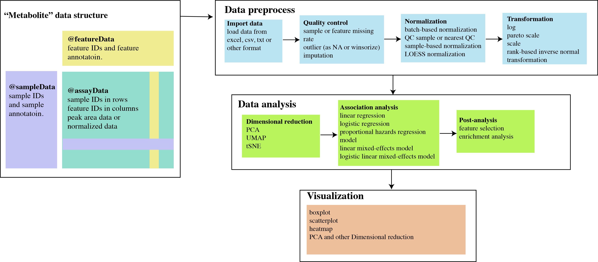

## Installation

| Type        | Command                                             |
|-------------|-----------------------------------------------------|
| Development | `remotes::install_github("XikunHan/metabolomicsR")` |

## Data structure

We first designed a “Metabolite” class based on the object-oriented
programming system S4 in R. For a particular “Metabolite” data, it will
include “assayData” (eg. peak area data or batch-normalized data,
samples in rows and metabolites in columns), “featureData” (metabolite
annotation), “sampleData” (sample annotation), “featureID”, “sampleID”,
“logs” (log information of data analysis process), and “miscData” (other
ancillary data).

## Import data

To demonstrate the package, we obtained the data from the Qatar
Metabolomics Study on Diabetes, similar to the data format from
non-targeted mass spectrometry by Metabolon. The dataset is also
available via [figshare](https://doi.org/10.6084/m9.figshare.5904022).

In the “assayData”, the first column is the sample IDs to match with
“sampleData”, the other columns are metabolite IDs to match with
“featureData”.

``` r
library(metabolomicsR)
library(data.table)
library(ggplot2)
library(cowplot)
library(plotROC)

# Load the dataset

file_path <- system.file("extdata", "QMDiab_metabolomics_OrigScale.xlsx", package = "metabolomicsR", mustWork = TRUE)

df_plasma <- load_excel(path = file_path,
                        data_sheet = 1,
                        feature_sheet = 4,
                        sample_sheet = 8,
                        sampleID = "QMDiab-ID",
                        featureID = "BIOCHEMICAL"
                        )
```

<details>
<summary>
**click to show plasma data**
</summary>

``` r
df_plasma
#>  An object of  Metabolite 
#>  
#>  ***  @assayData (first and last 10 columns [ 356  *  759 ])  ***
#>       QMDiab-ID 1,11-Undecanedicarboxylic acid 1,2-dipalmitoylglycerol
#>    1: QMDiab222                           8578                      NA
#>    2: QMDiab113                          15145                      NA
#>    3:  QMDiab29                             NA                   96455
#>    4: QMDiab243                          19692                   69444
#>    5: QMDiab270                             NA                      NA
#>   ---                                                                 
#>  352: QMDiab352                           6689                  116932
#>  353: QMDiab135                           7556                  248824
#>  354: QMDiab229                          20252                   80804
#>  355: QMDiab202                           7378                  108152
#>  356: QMDiab103                           6667                   57851
#>       1,2-propanediol 1,3,7-trimethylurate 1,3-dihydroxyacetone
#>    1:          103724                22259               104059
#>    2:              NA                39841                   NA
#>    3:          159945                10605               165416
#>    4:          108965                38562               139866
#>    5:          157617                 4490                   NA
#>   ---                                                          
#>  352:          115737                34791               152711
#>  353:          481008                 4766               164853
#>  354:          138253                13949                85019
#>  355:          112229                21748               175918
#>  356:          146948                 8458                82064
#>       1,3-dipalmitoylglycerol 1,5-anhydroglucitol (1,5-AG) 1,7-dimethylurate
#>    1:                    7067                       357499             19986
#>    2:                   36542                       440058             16620
#>    3:                   54209                       355790             12220
#>    4:                   22412                       185273             29537
#>    5:                   21958                       692753             10256
#>   ---                                                                       
#>  352:                   59120                       178759             25326
#>  353:                  126065                       103647             12253
#>  354:                   43072                       330579             15124
#>  355:                   78154                       106745             21434
#>  356:                   34234                       534697             12979
#>       1-arachidonoylglycerophosphocholine* X - 19183 X - 19299 X - 19302
#>    1:                              2173598        NA        NA        NA
#>    2:                              2464846        NA      9033        NA
#>    3:                              2613798        NA     10231        NA
#>    4:                              2543266        NA        NA     12291
#>    5:                              2138029        NA      6775        NA
#>   ---                                                                   
#>  352:                               864647        NA        NA        NA
#>  353:                              3018611      4769        NA        NA
#>  354:                              1398965        NA        NA        NA
#>  355:                              2104899        NA        NA        NA
#>  356:                               992388        NA        NA        NA
#>       X - 19380 X - 19411 X - 19434 X - 19436 X - 19437 X - 19438 X - 19451
#>    1:    158054     88569      7539        NA     64644     18055        NA
#>    2:    125669     87268     12681        NA     52074     12805      2994
#>    3:    194732    106360      7787        NA     31782     18467        NA
#>    4:    152853    119643        NA        NA     67713     12356        NA
#>    5:    204978    149644        NA        NA    108660     12479        NA
#>   ---                                                                      
#>  352:    195331    134564        NA        NA     22141     17205        NA
#>  353:    136120     75431     10876        NA     61867     28223        NA
#>  354:    216380    128925        NA        NA     84299     14936        NA
#>  355:    162256    112923        NA        NA     42586     51588        NA
#>  356:    137705    112636        NA        NA     89283     23515     10619
#>       X - 19574
#>    1:        NA
#>    2:        NA
#>    3:        NA
#>    4:        NA
#>    5:        NA
#>   ---          
#>  352:        NA
#>  353:     16573
#>  354:        NA
#>  355:        NA
#>  356:        NA
#>  
#>  ***  @featureData (ID:  featureID ) ***
#>       PATHWAY_SORTORDER                    BIOCHEMICAL SUPER_PATHWAY
#>    1:             800.1 1,11-Undecanedicarboxylic acid         Lipid
#>    2:              1070        1,2-dipalmitoylglycerol         Lipid
#>    3:               986                1,2-propanediol         Lipid
#>    4:              1805           1,3,7-trimethylurate   Xenobiotics
#>    5:               600           1,3-dihydroxyacetone  Carbohydrate
#>   ---                                                               
#>  754:              <NA>                      X - 19436          <NA>
#>  755:              <NA>                      X - 19437          <NA>
#>  756:              <NA>                      X - 19438          <NA>
#>  757:              <NA>                      X - 19451          <NA>
#>  758:              <NA>                      X - 19574          <NA>
#>                                            SUB_PATHWAY COMP_ID  PLATFORM
#>    1:                        Fatty acid, dicarboxylate   43027 LC/MS Neg
#>    2:                                   Diacylglycerol   11953     GC/MS
#>    3:                                    Ketone bodies   38002     GC/MS
#>    4:                              Xanthine metabolism   34404 LC/MS Neg
#>    5: Glycolysis, gluconeogenesis, pyruvate metabolism   35963     GC/MS
#>   ---                                                                   
#>  754:                                             <NA>   42912 LC/MS Neg
#>  755:                                             <NA>   42913 LC/MS Neg
#>  756:                                             <NA>   42914 LC/MS Neg
#>  757:                                             <NA>   42927 LC/MS Neg
#>  758:                                             <NA>   43130 LC/MS Neg
#>                       RI               MASS PUBCHEM                 CAS   KEGG
#>    1:               3578              243.2   10458           505-52-2;   <NA>
#>    2:               2600                145   99931         40290-32-2;   <NA>
#>    3:               1041                117    <NA>            57-55-6; C00583
#>    4:               1988              209.1   79437          5415-44-1; C16361
#>    5:               1263                103     670 96-26-4;62147-49-3; C00184
#>   ---                                                                         
#>  754:               4747              467.4    <NA>                <NA>   <NA>
#>  755: 1150.0999999999999              397.1    <NA>                <NA>   <NA>
#>  756:             1222.3              217.1    <NA>                <NA>   <NA>
#>  757:             3728.5              239.1    <NA>                <NA>   <NA>
#>  758:             4045.7 307.10000000000002    <NA>                <NA>   <NA>
#>         HMDb_ID COMP_IDstr                      featureID
#>    1: HMDB02327     M43027 1,11-Undecanedicarboxylic acid
#>    2: HMDB07098     M11953        1,2-dipalmitoylglycerol
#>    3: HMDB01881     M38002                1,2-propanediol
#>    4: HMDB02123     M34404           1,3,7-trimethylurate
#>    5: HMDB01882     M35963           1,3-dihydroxyacetone
#>   ---                                                    
#>  754:      <NA>     M42912                      X - 19436
#>  755:      <NA>     M42913                      X - 19437
#>  756:      <NA>     M42914                      X - 19438
#>  757:      <NA>     M42927                      X - 19451
#>  758:      <NA>     M43130                      X - 19574
#>  
#>  ***  @sampleData (ID:  QMDiab-ID ) ***
#>       QMDiab-ID      AGE GENDER      BMI ETHNICITY T2D
#>    1: QMDiab222 34.50513      0 25.01021         2   0
#>    2: QMDiab113 47.06639      1 28.36776         3   0
#>    3:  QMDiab29 55.49076      1 29.70564         1   0
#>    4: QMDiab243 56.33402      1 23.14050         2   0
#>    5: QMDiab270 35.63039      1 30.06229         1   0
#>   ---                                                 
#>  352: QMDiab352 41.55510      1 31.22690         3   1
#>  353: QMDiab135 52.55305      0 29.07577         2   1
#>  354: QMDiab229 30.31348      0 22.22656         2   0
#>  355: QMDiab202 49.40999      1 33.72008         1   1
#>  356: QMDiab103 23.85489      0 35.96389         1   0
#>  
#>  ***  @miscData  ***
#>  list()
#>  
#>  ***  @logs  ***
#>  06/03/22 09:48:22: Import data from: /Library/Frameworks/R.framework/Versions/4.1/Resources/library/metabolomicsR/extdata/QMDiab_metabolomics_OrigScale.xlsx .
#>  06/03/22 09:48:22: Initiate data: 356 samples and 758 features.
```

</details>

``` r
# change the feature ID to the column `COMP_IDstr`
df_plasma <- update_Metabolite(df_plasma, dataset = "COMP_IDstr", action = "change_featureID")
```

<details>
<summary>
**click to show plasma data**
</summary>

``` r
df_plasma
#>  An object of  Metabolite 
#>  
#>  ***  @assayData (first and last 10 columns [ 356  *  759 ])  ***
#>       QMDiab-ID M43027 M11953 M38002 M34404 M35963 M35728 M20675 M34400  M33228
#>    1: QMDiab222   8578     NA 103724  22259 104059   7067 357499  19986 2173598
#>    2: QMDiab113  15145     NA     NA  39841     NA  36542 440058  16620 2464846
#>    3:  QMDiab29     NA  96455 159945  10605 165416  54209 355790  12220 2613798
#>    4: QMDiab243  19692  69444 108965  38562 139866  22412 185273  29537 2543266
#>    5: QMDiab270     NA     NA 157617   4490     NA  21958 692753  10256 2138029
#>   ---                                                                          
#>  352: QMDiab352   6689 116932 115737  34791 152711  59120 178759  25326  864647
#>  353: QMDiab135   7556 248824 481008   4766 164853 126065 103647  12253 3018611
#>  354: QMDiab229  20252  80804 138253  13949  85019  43072 330579  15124 1398965
#>  355: QMDiab202   7378 108152 112229  21748 175918  78154 106745  21434 2104899
#>  356: QMDiab103   6667  57851 146948   8458  82064  34234 534697  12979  992388
#>       M42659 M42775 M42778 M42856 M42887 M42910 M42912 M42913 M42914 M42927
#>    1:     NA     NA     NA 158054  88569   7539     NA  64644  18055     NA
#>    2:     NA   9033     NA 125669  87268  12681     NA  52074  12805   2994
#>    3:     NA  10231     NA 194732 106360   7787     NA  31782  18467     NA
#>    4:     NA     NA  12291 152853 119643     NA     NA  67713  12356     NA
#>    5:     NA   6775     NA 204978 149644     NA     NA 108660  12479     NA
#>   ---                                                                      
#>  352:     NA     NA     NA 195331 134564     NA     NA  22141  17205     NA
#>  353:   4769     NA     NA 136120  75431  10876     NA  61867  28223     NA
#>  354:     NA     NA     NA 216380 128925     NA     NA  84299  14936     NA
#>  355:     NA     NA     NA 162256 112923     NA     NA  42586  51588     NA
#>  356:     NA     NA     NA 137705 112636     NA     NA  89283  23515  10619
#>       M43130
#>    1:     NA
#>    2:     NA
#>    3:     NA
#>    4:     NA
#>    5:     NA
#>   ---       
#>  352:     NA
#>  353:  16573
#>  354:     NA
#>  355:     NA
#>  356:     NA
#>  
#>  ***  @featureData (ID:  featureID ) ***
#>       PATHWAY_SORTORDER                    BIOCHEMICAL SUPER_PATHWAY
#>    1:             800.1 1,11-Undecanedicarboxylic acid         Lipid
#>    2:              1070        1,2-dipalmitoylglycerol         Lipid
#>    3:               986                1,2-propanediol         Lipid
#>    4:              1805           1,3,7-trimethylurate   Xenobiotics
#>    5:               600           1,3-dihydroxyacetone  Carbohydrate
#>   ---                                                               
#>  754:              <NA>                      X - 19436          <NA>
#>  755:              <NA>                      X - 19437          <NA>
#>  756:              <NA>                      X - 19438          <NA>
#>  757:              <NA>                      X - 19451          <NA>
#>  758:              <NA>                      X - 19574          <NA>
#>                                            SUB_PATHWAY COMP_ID  PLATFORM
#>    1:                        Fatty acid, dicarboxylate   43027 LC/MS Neg
#>    2:                                   Diacylglycerol   11953     GC/MS
#>    3:                                    Ketone bodies   38002     GC/MS
#>    4:                              Xanthine metabolism   34404 LC/MS Neg
#>    5: Glycolysis, gluconeogenesis, pyruvate metabolism   35963     GC/MS
#>   ---                                                                   
#>  754:                                             <NA>   42912 LC/MS Neg
#>  755:                                             <NA>   42913 LC/MS Neg
#>  756:                                             <NA>   42914 LC/MS Neg
#>  757:                                             <NA>   42927 LC/MS Neg
#>  758:                                             <NA>   43130 LC/MS Neg
#>                       RI               MASS PUBCHEM                 CAS   KEGG
#>    1:               3578              243.2   10458           505-52-2;   <NA>
#>    2:               2600                145   99931         40290-32-2;   <NA>
#>    3:               1041                117    <NA>            57-55-6; C00583
#>    4:               1988              209.1   79437          5415-44-1; C16361
#>    5:               1263                103     670 96-26-4;62147-49-3; C00184
#>   ---                                                                         
#>  754:               4747              467.4    <NA>                <NA>   <NA>
#>  755: 1150.0999999999999              397.1    <NA>                <NA>   <NA>
#>  756:             1222.3              217.1    <NA>                <NA>   <NA>
#>  757:             3728.5              239.1    <NA>                <NA>   <NA>
#>  758:             4045.7 307.10000000000002    <NA>                <NA>   <NA>
#>         HMDb_ID COMP_IDstr featureID
#>    1: HMDB02327     M43027    M43027
#>    2: HMDB07098     M11953    M11953
#>    3: HMDB01881     M38002    M38002
#>    4: HMDB02123     M34404    M34404
#>    5: HMDB01882     M35963    M35963
#>   ---                               
#>  754:      <NA>     M42912    M42912
#>  755:      <NA>     M42913    M42913
#>  756:      <NA>     M42914    M42914
#>  757:      <NA>     M42927    M42927
#>  758:      <NA>     M43130    M43130
#>  
#>  ***  @sampleData (ID:  QMDiab-ID ) ***
#>       QMDiab-ID      AGE GENDER      BMI ETHNICITY T2D
#>    1: QMDiab222 34.50513      0 25.01021         2   0
#>    2: QMDiab113 47.06639      1 28.36776         3   0
#>    3:  QMDiab29 55.49076      1 29.70564         1   0
#>    4: QMDiab243 56.33402      1 23.14050         2   0
#>    5: QMDiab270 35.63039      1 30.06229         1   0
#>   ---                                                 
#>  352: QMDiab352 41.55510      1 31.22690         3   1
#>  353: QMDiab135 52.55305      0 29.07577         2   1
#>  354: QMDiab229 30.31348      0 22.22656         2   0
#>  355: QMDiab202 49.40999      1 33.72008         1   1
#>  356: QMDiab103 23.85489      0 35.96389         1   0
#>  
#>  ***  @miscData  ***
#>  list()
#>  
#>  ***  @logs  ***
#>  06/03/22 09:48:22: Import data from: /Library/Frameworks/R.framework/Versions/4.1/Resources/library/metabolomicsR/extdata/QMDiab_metabolomics_OrigScale.xlsx .
#>  06/03/22 09:48:22: Initiate data: 356 samples and 758 features.
#>  06/03/22 09:48:23: Update data, action: change_featureID, 356 samples and 758 features.
```

</details>

``` r
# load urine metabolomic data
df_urine <- load_excel(path = file_path,
                        data_sheet = 2,
                        feature_sheet = 5,
                        sample_sheet = 9,
                        sampleID = "QMDiab-ID",
                        featureID = "BIOCHEMICAL"
                        )

df_urine <- update_Metabolite(df_urine, dataset = "COMP_IDstr", action = "change_featureID")
```

<details>
<summary>
**click to show urine data**
</summary>

``` r
df_urine
#>  An object of  Metabolite 
#>  
#>  ***  @assayData (first and last 10 columns [ 359  *  892 ])  ***
#>       QMDiab-ID   M38002 M34404  M32391 M20675   M21049  M34400 M40506  M34455
#>    1: QMDiab254  1189337 146900  265120  53499 15379982  619745  53261  227263
#>    2: QMDiab290  9944836 716781 2042008  71989 26406420 1988553 123129 1221563
#>    3:  QMDiab54   926350 182438  775726  48752  7551248 1159521  72837  215868
#>    4:  QMDiab55   305459 579097  511122  21423  4655848 1102500 131674      NA
#>    5: QMDiab319   574761 295176  175826  91788  2762680  417870  21631  243512
#>   ---                                                                         
#>  355:  QMDiab70  1139559 117975  326903     NA 10051449  406266 234997  183234
#>  356: QMDiab118  1517228 234288      NA  24350  2613189  375914  51929      NA
#>  357:  QMDiab65  1028291 352068  609710 113673 29650920  621166 130037  549992
#>  358: QMDiab248  1807105 338741  148964  62614   937893  603113  48151  293379
#>  359:   QMDiab4 10103832 203176  245175  50822 28406416  243598  74996  696766
#>         M30460 M42272 M42314 M42335 M42351 M42352 M42553 M42856 M42913 M43112
#>    1:  5502123  96913  31056  33430     NA  35558     NA  23369  21931     NA
#>    2: 17475172 124745  66036  39595     NA 732853     NA  28220  27811     NA
#>    3:  6423459  44266  23363  39645     NA  62630     NA  13148  25018     NA
#>    4:  4246983  77365  40193  46686     NA  92981     NA  22845  23620     NA
#>    5:  2780633  24081  16319  25583     NA  31037     NA  29122  41337     NA
#>   ---                                                                        
#>  355:  1407294  54919  52317  78413     NA  38453     NA  33084 195136     NA
#>  356:  1856043  42309  17973  25751     NA  12967     NA  15268  31577     NA
#>  357: 10131966 110335  40228  34299     NA 108341     NA  52714  33244     NA
#>  358:       NA  36055  29644  22465     NA  19287     NA  27299  36462     NA
#>  359: 27087992 185546  45205  60944     NA 149210   9804  35991 186372     NA
#>       M43129 M43130
#>    1:     NA     NA
#>    2:     NA   7215
#>    3:     NA   8596
#>    4:     NA     NA
#>    5:     NA     NA
#>   ---              
#>  355:     NA   5700
#>  356:     NA  11083
#>  357:     NA   6296
#>  358:     NA     NA
#>  359:     NA   7482
#>  
#>  ***  @featureData (ID:  featureID ) ***
#>       PATHWAY_SORTORDER                  BIOCHEMICAL SUPER_PATHWAY
#>    1:               986              1,2-propanediol         Lipid
#>    2:              1805         1,3,7-trimethylurate   Xenobiotics
#>    3:              1802            1,3-dimethylurate   Xenobiotics
#>    4:               583 1,5-anhydroglucitol (1,5-AG)  Carbohydrate
#>    5:               591           1,6-anhydroglucose  Carbohydrate
#>   ---                                                             
#>  887:              <NA>                    X - 19380          <NA>
#>  888:              <NA>                    X - 19437          <NA>
#>  889:              <NA>                    X - 19556          <NA>
#>  890:              <NA>                    X - 19573          <NA>
#>  891:              <NA>                    X - 19574          <NA>
#>                                            SUB_PATHWAY COMP_ID  PLATFORM
#>    1:                                    Ketone bodies   38002     GC/MS
#>    2:                              Xanthine metabolism   34404 LC/MS Neg
#>    3:                              Xanthine metabolism   32391     GC/MS
#>    4: Glycolysis, gluconeogenesis, pyruvate metabolism   20675 LC/MS Neg
#>    5: Glycolysis, gluconeogenesis, pyruvate metabolism   21049     GC/MS
#>   ---                                                                   
#>  887:                                             <NA>   42856 LC/MS Neg
#>  888:                                             <NA>   42913 LC/MS Neg
#>  889:                                             <NA>   43112 LC/MS Pos
#>  890:                                             <NA>   43129 LC/MS Neg
#>  891:                                             <NA>   43130 LC/MS Neg
#>                       RI               MASS  PUBCHEM        CAS   KEGG   HMDb_ID
#>    1:               1041                117     <NA>   57-55-6; C00583 HMDB01881
#>    2:               1988              209.1    79437 5415-44-1; C16361 HMDB02123
#>    3:               1937 325.10000000000002    70346 944-73-0 ;   <NA> HMDB01857
#>    4:                808 163.19999999999999     <NA>  154-58-5; C07326 HMDB02712
#>    5:             1679.5              204.1 11412545  498-07-7;   <NA> HMDB00640
#>   ---                                                                           
#>  887:               2287              412.4     <NA>       <NA>   <NA>      <NA>
#>  888: 1150.0999999999999              397.1     <NA>       <NA>   <NA>      <NA>
#>  889: 4249.8999999999996              404.9     <NA>       <NA>   <NA>      <NA>
#>  890:             3906.5              403.2     <NA>       <NA>   <NA>      <NA>
#>  891:             4045.7 307.10000000000002     <NA>       <NA>   <NA>      <NA>
#>       COMP_IDstr featureID
#>    1:     M38002    M38002
#>    2:     M34404    M34404
#>    3:     M32391    M32391
#>    4:     M20675    M20675
#>    5:     M21049    M21049
#>   ---                     
#>  887:     M42856    M42856
#>  888:     M42913    M42913
#>  889:     M43112    M43112
#>  890:     M43129    M43129
#>  891:     M43130    M43130
#>  
#>  ***  @sampleData (ID:  QMDiab-ID ) ***
#>       QMDiab-ID      AGE GENDER      BMI ETHNICITY T2D
#>    1: QMDiab254 53.10335      0 32.05128         1   0
#>    2: QMDiab290 39.79192      1 30.51426         4   0
#>    3:  QMDiab54 36.82136      0 24.16831         1   0
#>    4:  QMDiab55 34.75975      0 44.44444         1   1
#>    5: QMDiab319 50.17933      1 27.18090         1   1
#>   ---                                                 
#>  355:  QMDiab70 35.40315      1 33.83403         1   1
#>  356: QMDiab118 49.06229      1 25.64494         1   0
#>  357:  QMDiab65 47.22245      1 23.38435         1   0
#>  358: QMDiab248 56.39151      0 27.58621         1   1
#>  359:   QMDiab4 24.22450      0 41.66521         1   0
#>  
#>  ***  @miscData  ***
#>  list()
#>  
#>  ***  @logs  ***
#>  06/03/22 09:48:23: Import data from: /Library/Frameworks/R.framework/Versions/4.1/Resources/library/metabolomicsR/extdata/QMDiab_metabolomics_OrigScale.xlsx .
#>  06/03/22 09:48:23: Initiate data: 359 samples and 891 features.
#>  06/03/22 09:48:23: Update data, action: change_featureID, 359 samples and 891 features.
```

</details>

``` r
# load saliva metatabolomic data
df_saliva <- load_excel(path = file_path,
                        data_sheet = 3,
                        feature_sheet = 6,
                        sample_sheet = 10,
                        sampleID = "QMDiab-ID",
                        featureID = "BIOCHEMICAL"
                        )

df_saliva <- update_Metabolite(df_saliva, dataset = "COMP_IDstr", action = "change_featureID")
```

<details>
<summary>
**click to show saliva data**
</summary>

``` r
df_saliva
#>  An object of  Metabolite 
#>  
#>  ***  @assayData (first and last 10 columns [ 321  *  603 ])  ***
#>       QMDiab-ID M43027  M38002 M01654 M35963 M35690 M20675 M21049 M34400 M35628
#>    1: QMDiab370  11974  720004     NA     NA  91544 211457     NA   2661     NA
#>    2: QMDiab245  15485  481889  24313  53097  80819 175312  25921   2250  27847
#>    3:  QMDiab34  13916  979243     NA  44158 104042 271930     NA     NA     NA
#>    4: QMDiab287  28023  825577     NA  57600 157057  50692     NA     NA     NA
#>    5: QMDiab355  22830 1150408     NA  63460 225965 741408  71523   3739     NA
#>   ---                                                                          
#>  317: QMDiab202  16493  488210     NA     NA 116683 158562     NA   3496  18241
#>  318:  QMDiab80  15254 3345272  23456  36201 120444 295726 107821     NA  14988
#>  319: QMDiab107  31452  578446     NA  20563 245882 234635     NA     NA     NA
#>  320: QMDiab352  18975  280464     NA     NA  20491  77539     NA     NA  19239
#>  321: QMDiab127  16344  881910  64403  44381 206525 912153     NA     NA  12066
#>       M42851 M42877 M42913 M42914 M43042 M43049 M43050 M43110 M43122 M43128
#>    1:   4937     NA   5390     NA  22149   4997   5548     NA     NA  14190
#>    2:   3316     NA  10883   1110  22797   8284     NA     NA     NA  15273
#>    3:   3260     NA     NA     NA  15291     NA     NA     NA     NA  10602
#>    4:   3463     NA   6735     NA  20655   5779     NA     NA     NA  13165
#>    5:   3887     NA   3670     NA  45619   6922     NA  12023     NA  15046
#>   ---                                                                      
#>  317:     NA     NA   7243     NA  14632     NA     NA     NA     NA  15163
#>  318:     NA     NA  10592   3708  15018   5433     NA     NA     NA  21337
#>  319:     NA     NA     NA   4409  37399   9265     NA  42065     NA  37183
#>  320:     NA     NA   9140   4056   3362     NA     NA     NA     NA  21376
#>  321:     NA   2645   7590   4894  25546   5422     NA     NA     NA  15142
#>       M43137
#>    1:     NA
#>    2:     NA
#>    3:     NA
#>    4:     NA
#>    5:     NA
#>   ---       
#>  317:     NA
#>  318:     NA
#>  319:     NA
#>  320:     NA
#>  321:     NA
#>  
#>  ***  @featureData (ID:  featureID ) ***
#>       PATHWAY_SORTORDER                BIOCHEMICAL SUPER_PATHWAY
#>    1:             800.1 1,11-undecanedicarboxylate         Lipid
#>    2:               986            1,2-propanediol         Lipid
#>    3:               273         1,3-diaminopropane    Amino acid
#>    4:               600       1,3-dihydroxyacetone  Carbohydrate
#>    5:              1494             1,4-butanediol   Xenobiotics
#>   ---                                                           
#>  598:              <NA>                  X - 19497          <NA>
#>  599:              <NA>                  X - 19554          <NA>
#>  600:              <NA>                  X - 19566          <NA>
#>  601:              <NA>                  X - 19572          <NA>
#>  602:              <NA>                  X - 19581          <NA>
#>                                            SUB_PATHWAY COMP_ID  PLATFORM
#>    1:                        Fatty acid, dicarboxylate   43027 LC/MS Neg
#>    2:                                    Ketone bodies   38002     GC/MS
#>    3:      Urea cycle; arginine-, proline-, metabolism    1654     GC/MS
#>    4: Glycolysis, gluconeogenesis, pyruvate metabolism   35963     GC/MS
#>    5:                                         Chemical   35690     GC/MS
#>   ---                                                                   
#>  598:                                             <NA>   43050 LC/MS Neg
#>  599:                                             <NA>   43110 LC/MS Pos
#>  600:                                             <NA>   43122 LC/MS Neg
#>  601:                                             <NA>   43128 LC/MS Neg
#>  602:                                             <NA>   43137 LC/MS Neg
#>                       RI  MASS PUBCHEM                 CAS   KEGG   HMDb_ID
#>    1:               3578 243.2   10458           505-52-2;   <NA> HMDB02327
#>    2:               1041   117    <NA>            57-55-6; C00583 HMDB01881
#>    3:             1633.8   174     428           109-76-2; C00986 HMDB00002
#>    4:               1263   103     670 96-26-4;62147-49-3; C00184 HMDB01882
#>    5:               1208 115.8    <NA>           110-63-4;   <NA>      <NA>
#>   ---                                                                      
#>  598:             3657.6 227.3    <NA>                <NA>   <NA>      <NA>
#>  599:             3618.7   471    <NA>                <NA>   <NA>      <NA>
#>  600:             2953.2 744.5    <NA>                <NA>   <NA>      <NA>
#>  601:             3761.2 431.3    <NA>                <NA>   <NA>      <NA>
#>  602: 4949.6000000000004 938.5    <NA>                <NA>   <NA>      <NA>
#>       COMP_IDstr featureID
#>    1:     M43027    M43027
#>    2:     M38002    M38002
#>    3:     M01654    M01654
#>    4:     M35963    M35963
#>    5:     M35690    M35690
#>   ---                     
#>  598:     M43050    M43050
#>  599:     M43110    M43110
#>  600:     M43122    M43122
#>  601:     M43128    M43128
#>  602:     M43137    M43137
#>  
#>  ***  @sampleData (ID:  QMDiab-ID ) ***
#>       QMDiab-ID      AGE GENDER      BMI ETHNICITY T2D
#>    1: QMDiab370 56.49829      1 25.76591         1   1
#>    2: QMDiab245 51.51540      0 23.89943         1   0
#>    3:  QMDiab34 28.00548      0 23.90118         3   0
#>    4: QMDiab287 41.43463      0 31.47107         4   1
#>    5: QMDiab355 28.34771      0 25.16103         1   0
#>   ---                                                 
#>  317: QMDiab202 49.40999      1 33.72008         1   1
#>  318:  QMDiab80 25.86995      0 29.89101         1   0
#>  319: QMDiab107 38.50240      1 24.60973         2   0
#>  320: QMDiab352 41.55510      1 31.22690         3   1
#>  321: QMDiab127 34.69952      1 30.47797         1   0
#>  
#>  ***  @miscData  ***
#>  list()
#>  
#>  ***  @logs  ***
#>  06/03/22 09:48:23: Import data from: /Library/Frameworks/R.framework/Versions/4.1/Resources/library/metabolomicsR/extdata/QMDiab_metabolomics_OrigScale.xlsx .
#>  06/03/22 09:48:23: Initiate data: 321 samples and 602 features.
#>  06/03/22 09:48:23: Update data, action: change_featureID, 321 samples and 602 features.
```

</details>

## Quality control pipeline

We provided a pipeline for metabolite and sample quality control (QC)
procedures with a series of functions. In the QC pipeline, we included
the following functions: remove metabolites or samples beyond a
particular missing rate threshold (eg. 0.5), detect outliers (eg. +- 5
SD) and replace outliers with NA or winsorize outliers, and popular
methods to impute missing values (eg. half of the minimum value). All
the steps can be customized to implement in the “QC_pipeline” function
or be used from the individual functions (eg.
“filter_column_missing_rate”, “replace_outlier”, and “impute”).

``` r
df_plasma_QC <- QC_pipeline(df_plasma, replace_outlier_method = "winsorize", impute_method = NULL)
#>  
#>  Constant columns n = 37
#>  
#>   Number of columns with a missing rate >= 0.5 : n = 176
```

<details>
<summary>
**click to show plasma data after QC**
</summary>

``` r
df_plasma_QC
#>  An object of  Metabolite 
#>  
#>  ***  @assayData (first and last 10 columns [ 356  *  546 ])  ***
#>       QMDiab-ID M43027 M11953 M38002 M34404 M35963 M35728 M20675 M34400  M33228
#>    1: QMDiab222   8578     NA 103724  22259 104059   7067 357499  19986 2173598
#>    2: QMDiab113  15145     NA     NA  39841     NA  36542 440058  16620 2464846
#>    3:  QMDiab29     NA  96455 159945  10605 165416  54209 355790  12220 2613798
#>    4: QMDiab243  19692  69444 108965  38562 139866  22412 185273  29537 2543266
#>    5: QMDiab270     NA     NA 157617   4490     NA  21958 692753  10256 2138029
#>   ---                                                                          
#>  352: QMDiab352   6689 116932 115737  34791 152711  59120 178759  25326  864647
#>  353: QMDiab135   7556 248824 481008   4766 164853 126065 103647  12253 3018611
#>  354: QMDiab229  20252  80804 138253  13949  85019  43072 330579  15124 1398965
#>  355: QMDiab202   7378 108152 112229  21748 175918  78154 106745  21434 2104899
#>  356: QMDiab103   6667  57851 146948   8458  82064  34234 534697  12979  992388
#>       M42307 M42314 M42544 M42548 M42549 M42552 M42554 M42856 M42887 M42913
#>    1:     NA  30592   3839  13734     NA     NA  37654 158054  88569  64644
#>    2:   6978  81380   4128  15288     NA   4697  28262 125669  87268  52074
#>    3:  17943 104253   6788  18861   6761   5096  30139 194732 106360  31782
#>    4:  11069  73203   8493  12138  10371  11207  21406 152853 119643  67713
#>    5:   7904  28846   7130  12843   3150   4556  14976 204978 149644 108660
#>   ---                                                                      
#>  352:  11539  40487   9988   6173   7678   9008  30501 195331 134564  22141
#>  353:   5441  37950     NA  18464     NA     NA  43687 136120  75431  61867
#>  354:     NA  18098   5766   8244   5932     NA  18728 216380 128925  84299
#>  355:   8119  70566   8470  11932     NA   5895  27858 162256 112923  42586
#>  356:   7647  46836   7420   8019     NA   8253  32159 137705 112636  89283
#>       M42914
#>    1:  18055
#>    2:  12805
#>    3:  18467
#>    4:  12356
#>    5:  12479
#>   ---       
#>  352:  17205
#>  353:  28223
#>  354:  14936
#>  355:  51588
#>  356:  23515
#>  
#>  ***  @featureData (ID:  featureID ) ***
#>       PATHWAY_SORTORDER                    BIOCHEMICAL SUPER_PATHWAY
#>    1:             800.1 1,11-Undecanedicarboxylic acid         Lipid
#>    2:              1070        1,2-dipalmitoylglycerol         Lipid
#>    3:               986                1,2-propanediol         Lipid
#>    4:              1805           1,3,7-trimethylurate   Xenobiotics
#>    5:               600           1,3-dihydroxyacetone  Carbohydrate
#>   ---                                                               
#>  754:              <NA>                      X - 19436          <NA>
#>  755:              <NA>                      X - 19437          <NA>
#>  756:              <NA>                      X - 19438          <NA>
#>  757:              <NA>                      X - 19451          <NA>
#>  758:              <NA>                      X - 19574          <NA>
#>                                            SUB_PATHWAY COMP_ID  PLATFORM
#>    1:                        Fatty acid, dicarboxylate   43027 LC/MS Neg
#>    2:                                   Diacylglycerol   11953     GC/MS
#>    3:                                    Ketone bodies   38002     GC/MS
#>    4:                              Xanthine metabolism   34404 LC/MS Neg
#>    5: Glycolysis, gluconeogenesis, pyruvate metabolism   35963     GC/MS
#>   ---                                                                   
#>  754:                                             <NA>   42912 LC/MS Neg
#>  755:                                             <NA>   42913 LC/MS Neg
#>  756:                                             <NA>   42914 LC/MS Neg
#>  757:                                             <NA>   42927 LC/MS Neg
#>  758:                                             <NA>   43130 LC/MS Neg
#>                       RI               MASS PUBCHEM                 CAS   KEGG
#>    1:               3578              243.2   10458           505-52-2;   <NA>
#>    2:               2600                145   99931         40290-32-2;   <NA>
#>    3:               1041                117    <NA>            57-55-6; C00583
#>    4:               1988              209.1   79437          5415-44-1; C16361
#>    5:               1263                103     670 96-26-4;62147-49-3; C00184
#>   ---                                                                         
#>  754:               4747              467.4    <NA>                <NA>   <NA>
#>  755: 1150.0999999999999              397.1    <NA>                <NA>   <NA>
#>  756:             1222.3              217.1    <NA>                <NA>   <NA>
#>  757:             3728.5              239.1    <NA>                <NA>   <NA>
#>  758:             4045.7 307.10000000000002    <NA>                <NA>   <NA>
#>         HMDb_ID COMP_IDstr featureID
#>    1: HMDB02327     M43027    M43027
#>    2: HMDB07098     M11953    M11953
#>    3: HMDB01881     M38002    M38002
#>    4: HMDB02123     M34404    M34404
#>    5: HMDB01882     M35963    M35963
#>   ---                               
#>  754:      <NA>     M42912    M42912
#>  755:      <NA>     M42913    M42913
#>  756:      <NA>     M42914    M42914
#>  757:      <NA>     M42927    M42927
#>  758:      <NA>     M43130    M43130
#>  
#>  ***  @sampleData (ID:  QMDiab-ID ) ***
#>       QMDiab-ID      AGE GENDER      BMI ETHNICITY T2D
#>    1: QMDiab222 34.50513      0 25.01021         2   0
#>    2: QMDiab113 47.06639      1 28.36776         3   0
#>    3:  QMDiab29 55.49076      1 29.70564         1   0
#>    4: QMDiab243 56.33402      1 23.14050         2   0
#>    5: QMDiab270 35.63039      1 30.06229         1   0
#>   ---                                                 
#>  352: QMDiab352 41.55510      1 31.22690         3   1
#>  353: QMDiab135 52.55305      0 29.07577         2   1
#>  354: QMDiab229 30.31348      0 22.22656         2   0
#>  355: QMDiab202 49.40999      1 33.72008         1   1
#>  356: QMDiab103 23.85489      0 35.96389         1   0
#>  
#>  ***  @miscData  ***
#>  list()
#>  
#>  ***  @logs  ***
#>  06/03/22 09:48:22: Import data from: /Library/Frameworks/R.framework/Versions/4.1/Resources/library/metabolomicsR/extdata/QMDiab_metabolomics_OrigScale.xlsx .
#>  06/03/22 09:48:22: Initiate data: 356 samples and 758 features.
#>  06/03/22 09:48:23: Update data, action: change_featureID, 356 samples and 758 features. 
#>  
#>  06/03/22 09:48:23: Run QC pipeline.
#>  06/03/22 09:48:23: Filter data with a constant column, removed 37 features. 
#>  06/03/22 09:48:23: Update data, 356 samples and 758 features. 
#>  06/03/22 09:48:24: Filter data with a missing rate >= 0.5, removed 176 features. 
#>  06/03/22 09:48:24: Update data, 356 samples and 758 features. 
#>  06/03/22 09:48:24: Replace outliers using `winsorize` method 5 SDs.
```

</details>

``` r
df_urine_QC <- QC_pipeline(df_urine, replace_outlier_method = "winsorize", impute_method = NULL)
#>  
#>  Constant columns n = 28
#>  
#>   Number of columns with a missing rate >= 0.5 : n = 77
```

<details>
<summary>
**click to show urine data after QC**
</summary>

``` r
df_urine_QC
#>  An object of  Metabolite 
#>  
#>  ***  @assayData (first and last 10 columns [ 359  *  787 ])  ***
#>       QMDiab-ID   M38002 M34404  M32391 M20675   M21049  M34400 M40506  M34455
#>    1: QMDiab254  1189337 146900  265120  53499 15379982  619745  53261  227263
#>    2: QMDiab290  9944836 716781 2042008  71989 26406420 1988553 123129 1221563
#>    3:  QMDiab54   926350 182438  775726  48752  7551248 1159521  72837  215868
#>    4:  QMDiab55   305459 579097  511122  21423  4655848 1102500 131674      NA
#>    5: QMDiab319   574761 295176  175826  91788  2762680  417870  21631  243512
#>   ---                                                                         
#>  355:  QMDiab70  1139559 117975  326903     NA 10051449  406266 234997  183234
#>  356: QMDiab118  1517228 234288      NA  24350  2613189  375914  51929      NA
#>  357:  QMDiab65  1028291 352068  609710 113673 29650920  621166 130037  549992
#>  358: QMDiab248  1807105 338741  148964  62614   937893  603113  48151  293379
#>  359:   QMDiab4 10103832 203176  245175  50822 28406416  243598  74996  696766
#>         M30460 M41595 M41702 M41709 M41768 M41837 M42272 M42314 M42335 M42352
#>    1:  5502123  74988  29007   4223  17008   5636  96913  31056  33430  35558
#>    2: 17475172  66278 101935  34251  14937   9552 124745  66036  39595 652059
#>    3:  6423459  74225  51295  14090  32971   9104  44266  23363  39645  62630
#>    4:  4246983  63809  31054   6151   8054  15148  77365  40193  46686  92981
#>    5:  2780633  40804   8307   3715  31370   5993  24081  16319  25583  31037
#>   ---                                                                        
#>  355:  1407294  67664  36157     NA  29194  15652  54919  52317  78413  38453
#>  356:  1856043  34332  29877  30817   5029   4603  42309  17973  25751  12967
#>  357: 10131966  57310  22374     NA  19358   9598 110335  40228  34299 108341
#>  358:       NA  26670   8525   7059  13231   9698  36055  29644  22465  19287
#>  359: 27087992  95140  66285  20229  35845  18570 185546  45205  60944 149210
#>       M42856 M42913
#>    1:  23369  21931
#>    2:  28220  27811
#>    3:  13148  25018
#>    4:  22845  23620
#>    5:  29122  41337
#>   ---              
#>  355:  33084 195136
#>  356:  15268  31577
#>  357:  52714  33244
#>  358:  27299  36462
#>  359:  35991 186372
#>  
#>  ***  @featureData (ID:  featureID ) ***
#>       PATHWAY_SORTORDER                  BIOCHEMICAL SUPER_PATHWAY
#>    1:               986              1,2-propanediol         Lipid
#>    2:              1805         1,3,7-trimethylurate   Xenobiotics
#>    3:              1802            1,3-dimethylurate   Xenobiotics
#>    4:               583 1,5-anhydroglucitol (1,5-AG)  Carbohydrate
#>    5:               591           1,6-anhydroglucose  Carbohydrate
#>   ---                                                             
#>  887:              <NA>                    X - 19380          <NA>
#>  888:              <NA>                    X - 19437          <NA>
#>  889:              <NA>                    X - 19556          <NA>
#>  890:              <NA>                    X - 19573          <NA>
#>  891:              <NA>                    X - 19574          <NA>
#>                                            SUB_PATHWAY COMP_ID  PLATFORM
#>    1:                                    Ketone bodies   38002     GC/MS
#>    2:                              Xanthine metabolism   34404 LC/MS Neg
#>    3:                              Xanthine metabolism   32391     GC/MS
#>    4: Glycolysis, gluconeogenesis, pyruvate metabolism   20675 LC/MS Neg
#>    5: Glycolysis, gluconeogenesis, pyruvate metabolism   21049     GC/MS
#>   ---                                                                   
#>  887:                                             <NA>   42856 LC/MS Neg
#>  888:                                             <NA>   42913 LC/MS Neg
#>  889:                                             <NA>   43112 LC/MS Pos
#>  890:                                             <NA>   43129 LC/MS Neg
#>  891:                                             <NA>   43130 LC/MS Neg
#>                       RI               MASS  PUBCHEM        CAS   KEGG   HMDb_ID
#>    1:               1041                117     <NA>   57-55-6; C00583 HMDB01881
#>    2:               1988              209.1    79437 5415-44-1; C16361 HMDB02123
#>    3:               1937 325.10000000000002    70346 944-73-0 ;   <NA> HMDB01857
#>    4:                808 163.19999999999999     <NA>  154-58-5; C07326 HMDB02712
#>    5:             1679.5              204.1 11412545  498-07-7;   <NA> HMDB00640
#>   ---                                                                           
#>  887:               2287              412.4     <NA>       <NA>   <NA>      <NA>
#>  888: 1150.0999999999999              397.1     <NA>       <NA>   <NA>      <NA>
#>  889: 4249.8999999999996              404.9     <NA>       <NA>   <NA>      <NA>
#>  890:             3906.5              403.2     <NA>       <NA>   <NA>      <NA>
#>  891:             4045.7 307.10000000000002     <NA>       <NA>   <NA>      <NA>
#>       COMP_IDstr featureID
#>    1:     M38002    M38002
#>    2:     M34404    M34404
#>    3:     M32391    M32391
#>    4:     M20675    M20675
#>    5:     M21049    M21049
#>   ---                     
#>  887:     M42856    M42856
#>  888:     M42913    M42913
#>  889:     M43112    M43112
#>  890:     M43129    M43129
#>  891:     M43130    M43130
#>  
#>  ***  @sampleData (ID:  QMDiab-ID ) ***
#>       QMDiab-ID      AGE GENDER      BMI ETHNICITY T2D
#>    1: QMDiab254 53.10335      0 32.05128         1   0
#>    2: QMDiab290 39.79192      1 30.51426         4   0
#>    3:  QMDiab54 36.82136      0 24.16831         1   0
#>    4:  QMDiab55 34.75975      0 44.44444         1   1
#>    5: QMDiab319 50.17933      1 27.18090         1   1
#>   ---                                                 
#>  355:  QMDiab70 35.40315      1 33.83403         1   1
#>  356: QMDiab118 49.06229      1 25.64494         1   0
#>  357:  QMDiab65 47.22245      1 23.38435         1   0
#>  358: QMDiab248 56.39151      0 27.58621         1   1
#>  359:   QMDiab4 24.22450      0 41.66521         1   0
#>  
#>  ***  @miscData  ***
#>  list()
#>  
#>  ***  @logs  ***
#>  06/03/22 09:48:23: Import data from: /Library/Frameworks/R.framework/Versions/4.1/Resources/library/metabolomicsR/extdata/QMDiab_metabolomics_OrigScale.xlsx .
#>  06/03/22 09:48:23: Initiate data: 359 samples and 891 features.
#>  06/03/22 09:48:23: Update data, action: change_featureID, 359 samples and 891 features. 
#>  
#>  06/03/22 09:48:24: Run QC pipeline.
#>  06/03/22 09:48:24: Filter data with a constant column, removed 28 features. 
#>  06/03/22 09:48:24: Update data, 359 samples and 891 features. 
#>  06/03/22 09:48:24: Filter data with a missing rate >= 0.5, removed 77 features. 
#>  06/03/22 09:48:24: Update data, 359 samples and 891 features. 
#>  06/03/22 09:48:25: Replace outliers using `winsorize` method 5 SDs.
```

</details>

``` r
df_saliva_QC <- QC_pipeline(df_saliva, replace_outlier_method = "winsorize", impute_method = NULL)
#>  
#>  Constant columns n = 35
#>  
#>   Number of columns with a missing rate >= 0.5 : n = 203
```

<details>
<summary>
**click to show saliva data after QC**
</summary>

``` r
df_saliva_QC
#>  An object of  Metabolite 
#>  
#>  ***  @assayData (first and last 10 columns [ 321  *  365 ])  ***
#>       QMDiab-ID M43027  M38002 M35690 M20675 M35628 M37536 M37752  M35691 M38276
#>    1: QMDiab370  11974  720004  91544 211457     NA     NA 121286  352891 161984
#>    2: QMDiab245  15485  481889  80819 175312  27847  24251  78051  179709 155695
#>    3:  QMDiab34  13916  979243 104042 271930     NA  19333  54685   58106  99814
#>    4: QMDiab287  28023  825577 157057  50692     NA  22527 134397   48854 134122
#>    5: QMDiab355  22830 1150408 225965 741408     NA  67922 113970  989663 232232
#>   ---                                                                           
#>  317: QMDiab202  16493  488210 116683 158562  18241  54375 119442  302910 345072
#>  318:  QMDiab80  15254 3345272 120444 295726  14988 112052  98093 1567170 445473
#>  319: QMDiab107  31452  578446 245882 234635     NA     NA  74245  171205 132903
#>  320: QMDiab352  18975  280464  20491  77539  19239  35706  53731   95315  97904
#>  321: QMDiab127  16344  881910 206525 912153  12066  30309 102026  843075 941156
#>       M41491  M41548 M41921 M42238 M42272 M42741 M42851 M42913 M43042 M43049
#>    1: 404368 1007590  10148   6156   2352     NA   4937   5390  22149   4997
#>    2: 360478  641392  11972   5093     NA  13502   3316  10883  22797   8284
#>    3: 368498  741774   4553   4875   9858     NA   3260     NA  15291     NA
#>    4: 900064  429374   7717     NA   6371     NA   3463   6735  20655   5779
#>    5: 506638  786827   7807     NA  11181  16551   3887   3670  45619   6922
#>   ---                                                                       
#>  317: 368498  264313  12567     NA  11743  12683     NA   7243  14632     NA
#>  318: 623000  367782  29507     NA     NA  32002     NA  10592  15018   5433
#>  319: 983332  883025  13123   4657     NA  19707     NA     NA  37399   9265
#>  320:  85130  230107  15529     NA     NA   4080     NA   9140   3362     NA
#>  321: 902186      NA  17118   9253   4176  60963     NA   7590  25546   5422
#>       M43128
#>    1:  14190
#>    2:  15273
#>    3:  10602
#>    4:  13165
#>    5:  15046
#>   ---       
#>  317:  15163
#>  318:  21337
#>  319:  37183
#>  320:  21376
#>  321:  15142
#>  
#>  ***  @featureData (ID:  featureID ) ***
#>       PATHWAY_SORTORDER                BIOCHEMICAL SUPER_PATHWAY
#>    1:             800.1 1,11-undecanedicarboxylate         Lipid
#>    2:               986            1,2-propanediol         Lipid
#>    3:               273         1,3-diaminopropane    Amino acid
#>    4:               600       1,3-dihydroxyacetone  Carbohydrate
#>    5:              1494             1,4-butanediol   Xenobiotics
#>   ---                                                           
#>  598:              <NA>                  X - 19497          <NA>
#>  599:              <NA>                  X - 19554          <NA>
#>  600:              <NA>                  X - 19566          <NA>
#>  601:              <NA>                  X - 19572          <NA>
#>  602:              <NA>                  X - 19581          <NA>
#>                                            SUB_PATHWAY COMP_ID  PLATFORM
#>    1:                        Fatty acid, dicarboxylate   43027 LC/MS Neg
#>    2:                                    Ketone bodies   38002     GC/MS
#>    3:      Urea cycle; arginine-, proline-, metabolism    1654     GC/MS
#>    4: Glycolysis, gluconeogenesis, pyruvate metabolism   35963     GC/MS
#>    5:                                         Chemical   35690     GC/MS
#>   ---                                                                   
#>  598:                                             <NA>   43050 LC/MS Neg
#>  599:                                             <NA>   43110 LC/MS Pos
#>  600:                                             <NA>   43122 LC/MS Neg
#>  601:                                             <NA>   43128 LC/MS Neg
#>  602:                                             <NA>   43137 LC/MS Neg
#>                       RI  MASS PUBCHEM                 CAS   KEGG   HMDb_ID
#>    1:               3578 243.2   10458           505-52-2;   <NA> HMDB02327
#>    2:               1041   117    <NA>            57-55-6; C00583 HMDB01881
#>    3:             1633.8   174     428           109-76-2; C00986 HMDB00002
#>    4:               1263   103     670 96-26-4;62147-49-3; C00184 HMDB01882
#>    5:               1208 115.8    <NA>           110-63-4;   <NA>      <NA>
#>   ---                                                                      
#>  598:             3657.6 227.3    <NA>                <NA>   <NA>      <NA>
#>  599:             3618.7   471    <NA>                <NA>   <NA>      <NA>
#>  600:             2953.2 744.5    <NA>                <NA>   <NA>      <NA>
#>  601:             3761.2 431.3    <NA>                <NA>   <NA>      <NA>
#>  602: 4949.6000000000004 938.5    <NA>                <NA>   <NA>      <NA>
#>       COMP_IDstr featureID
#>    1:     M43027    M43027
#>    2:     M38002    M38002
#>    3:     M01654    M01654
#>    4:     M35963    M35963
#>    5:     M35690    M35690
#>   ---                     
#>  598:     M43050    M43050
#>  599:     M43110    M43110
#>  600:     M43122    M43122
#>  601:     M43128    M43128
#>  602:     M43137    M43137
#>  
#>  ***  @sampleData (ID:  QMDiab-ID ) ***
#>       QMDiab-ID      AGE GENDER      BMI ETHNICITY T2D
#>    1: QMDiab370 56.49829      1 25.76591         1   1
#>    2: QMDiab245 51.51540      0 23.89943         1   0
#>    3:  QMDiab34 28.00548      0 23.90118         3   0
#>    4: QMDiab287 41.43463      0 31.47107         4   1
#>    5: QMDiab355 28.34771      0 25.16103         1   0
#>   ---                                                 
#>  317: QMDiab202 49.40999      1 33.72008         1   1
#>  318:  QMDiab80 25.86995      0 29.89101         1   0
#>  319: QMDiab107 38.50240      1 24.60973         2   0
#>  320: QMDiab352 41.55510      1 31.22690         3   1
#>  321: QMDiab127 34.69952      1 30.47797         1   0
#>  
#>  ***  @miscData  ***
#>  list()
#>  
#>  ***  @logs  ***
#>  06/03/22 09:48:23: Import data from: /Library/Frameworks/R.framework/Versions/4.1/Resources/library/metabolomicsR/extdata/QMDiab_metabolomics_OrigScale.xlsx .
#>  06/03/22 09:48:23: Initiate data: 321 samples and 602 features.
#>  06/03/22 09:48:23: Update data, action: change_featureID, 321 samples and 602 features. 
#>  
#>  06/03/22 09:48:25: Run QC pipeline.
#>  06/03/22 09:48:25: Filter data with a constant column, removed 35 features. 
#>  06/03/22 09:48:25: Update data, 321 samples and 602 features. 
#>  06/03/22 09:48:25: Filter data with a missing rate >= 0.5, removed 203 features. 
#>  06/03/22 09:48:25: Update data, 321 samples and 602 features. 
#>  06/03/22 09:48:25: Replace outliers using `winsorize` method 5 SDs.
```

</details>

## Transformation

Transformation of metabolites can alter the distribution of data and is
an essential step for the following statistical analysis. We provided
the following transformation methods: log (natural logarithm), pareto
scale, scale, and rank-based inverse normal transformation.

``` r
df_plasma_QC <- impute(df_plasma_QC, method = "half-min")
df_plasma_scale <-  transformation(df_plasma_QC, method = "log")
df_plasma_scale <-  transformation(df_plasma_scale, method = "scale")
```

<details>
<summary>
**click to show plasma data after scaling**
</summary>

``` r
df_plasma_scale
#>  An object of  Metabolite 
#>  
#>  ***  @assayData (first and last 10 columns [ 356  *  546 ])  ***
#>       QMDiab-ID      M43027      M11953      M38002     M34404     M35963
#>    1: QMDiab222  0.38328962 -2.06937034 -0.25776988  0.1300954  0.1329676
#>    2: QMDiab113  1.09208975 -2.06937034 -2.09811585  0.7401431 -2.7715161
#>    3:  QMDiab29 -2.07224771  0.37986636  0.19492231 -0.6468556  0.7526296
#>    4: QMDiab243  1.41944199  0.02182271 -0.20624637  0.7059502  0.5283257
#>    5: QMDiab270 -2.07224771 -2.06937034  0.17959695 -1.5475159 -2.7715161
#>   ---                                                                    
#>  352: QMDiab352  0.07315101  0.58966058 -0.14322471  0.5981101  0.6457892
#>  353: QMDiab135  0.22511485  1.41258850  1.34579403 -1.4850024  0.7480716
#>  354: QMDiab229  1.45440521  0.18692608  0.04258334 -0.3596389 -0.1371982
#>  355: QMDiab202  0.19539060  0.50460026 -0.17539627  0.1057578  0.8349219
#>  356: QMDiab103  0.06904336 -0.17721998  0.10633646 -0.8839089 -0.1844916
#>            M35728     M20675     M34400     M33228      M42307      M42314
#>    1: -2.15022266  0.4846600  0.1504626  0.7147450 -1.66388170 -0.28947392
#>    2: -0.22011372  0.7246235 -0.1016651  0.9880064  0.23596643  1.43130720
#>    3:  0.24318100  0.4791258 -0.5220933  1.1155149  1.20217335  1.86694301
#>    4: -0.79439802 -0.2744750  0.6844679  1.0560683  0.70798740  1.24506376
#>    5: -0.81843882  1.2486906 -0.7616244  0.6788895  0.36344522 -0.39283289
#>   ---                                                                     
#>  352:  0.34505615 -0.3158120  0.4741913 -1.2884859  0.75053010  0.20341269
#>  353:  1.23459353 -0.9453014 -0.5184065  1.4284294 -0.01856785  0.08959909
#>  354: -0.02697569  0.3942445 -0.2306154 -0.2428478 -1.66388170 -1.21272633
#>  355:  0.67293679 -0.9112866  0.2460864  0.6449519  0.39090187  1.18053745
#>  356: -0.29675648  0.9495957 -0.4397136 -0.9890440  0.32962775  0.45961727
#>           M42544      M42548     M42549      M42552      M42554      M42856
#>    1: -0.7965687 -0.10047059 -0.9487939 -1.37729107  0.68352801 -0.11254665
#>    2: -0.6745840  0.07424437 -0.9487939  0.08365871  0.29566066 -0.99002949
#>    3:  0.1613181  0.41656906  0.8587908  0.18047655  0.38258560  0.68610780
#>    4:  0.5379320 -0.30181776  1.2068728  1.11631207 -0.07994001 -0.24059952
#>    5:  0.2439311 -0.20979707  0.2374080  0.04746543 -0.56284248  0.88235205
#>   ---                                                                      
#>  352:  0.8104388 -1.40388426  0.9622680  0.85693528  0.39872567  0.69786177
#>  353: -2.8888549  0.38189554 -0.9487939 -1.37729107  0.88442476 -0.68430531
#>  354: -0.1129294 -0.93235314  0.7523676 -1.37729107 -0.26061363  1.08952272
#>  355:  0.5333744 -0.32971701 -0.9487939  0.35343194  0.27619711 -0.01213065
#>  356:  0.3109356 -0.97745562 -0.9487939  0.75298733  0.47028172 -0.64000024
#>           M42887     M42913      M42914
#>    1: -1.0147901  0.0919409 -0.07636980
#>    2: -1.0843123 -0.2871253 -0.80423166
#>    3: -0.1548217 -1.1527328 -0.02857249
#>    4:  0.3980587  0.1732535 -0.87984647
#>    5:  1.4492342  1.0023618 -0.85886254
#>   ---                                  
#>  352:  0.9502102 -1.7864144 -0.17852561
#>  353: -1.7691271  0.0149663  0.86995988
#>  354:  0.7490907  0.5573375 -0.47812467
#>  355:  0.1264821 -0.6397389  2.14768955
#>  356:  0.1145265  0.6580360  0.48335069
#>  
#>  ***  @featureData (ID:  featureID ) ***
#>       PATHWAY_SORTORDER                    BIOCHEMICAL SUPER_PATHWAY
#>    1:             800.1 1,11-Undecanedicarboxylic acid         Lipid
#>    2:              1070        1,2-dipalmitoylglycerol         Lipid
#>    3:               986                1,2-propanediol         Lipid
#>    4:              1805           1,3,7-trimethylurate   Xenobiotics
#>    5:               600           1,3-dihydroxyacetone  Carbohydrate
#>   ---                                                               
#>  754:              <NA>                      X - 19436          <NA>
#>  755:              <NA>                      X - 19437          <NA>
#>  756:              <NA>                      X - 19438          <NA>
#>  757:              <NA>                      X - 19451          <NA>
#>  758:              <NA>                      X - 19574          <NA>
#>                                            SUB_PATHWAY COMP_ID  PLATFORM
#>    1:                        Fatty acid, dicarboxylate   43027 LC/MS Neg
#>    2:                                   Diacylglycerol   11953     GC/MS
#>    3:                                    Ketone bodies   38002     GC/MS
#>    4:                              Xanthine metabolism   34404 LC/MS Neg
#>    5: Glycolysis, gluconeogenesis, pyruvate metabolism   35963     GC/MS
#>   ---                                                                   
#>  754:                                             <NA>   42912 LC/MS Neg
#>  755:                                             <NA>   42913 LC/MS Neg
#>  756:                                             <NA>   42914 LC/MS Neg
#>  757:                                             <NA>   42927 LC/MS Neg
#>  758:                                             <NA>   43130 LC/MS Neg
#>                       RI               MASS PUBCHEM                 CAS   KEGG
#>    1:               3578              243.2   10458           505-52-2;   <NA>
#>    2:               2600                145   99931         40290-32-2;   <NA>
#>    3:               1041                117    <NA>            57-55-6; C00583
#>    4:               1988              209.1   79437          5415-44-1; C16361
#>    5:               1263                103     670 96-26-4;62147-49-3; C00184
#>   ---                                                                         
#>  754:               4747              467.4    <NA>                <NA>   <NA>
#>  755: 1150.0999999999999              397.1    <NA>                <NA>   <NA>
#>  756:             1222.3              217.1    <NA>                <NA>   <NA>
#>  757:             3728.5              239.1    <NA>                <NA>   <NA>
#>  758:             4045.7 307.10000000000002    <NA>                <NA>   <NA>
#>         HMDb_ID COMP_IDstr featureID
#>    1: HMDB02327     M43027    M43027
#>    2: HMDB07098     M11953    M11953
#>    3: HMDB01881     M38002    M38002
#>    4: HMDB02123     M34404    M34404
#>    5: HMDB01882     M35963    M35963
#>   ---                               
#>  754:      <NA>     M42912    M42912
#>  755:      <NA>     M42913    M42913
#>  756:      <NA>     M42914    M42914
#>  757:      <NA>     M42927    M42927
#>  758:      <NA>     M43130    M43130
#>  
#>  ***  @sampleData (ID:  QMDiab-ID ) ***
#>       QMDiab-ID      AGE GENDER      BMI ETHNICITY T2D
#>    1: QMDiab222 34.50513      0 25.01021         2   0
#>    2: QMDiab113 47.06639      1 28.36776         3   0
#>    3:  QMDiab29 55.49076      1 29.70564         1   0
#>    4: QMDiab243 56.33402      1 23.14050         2   0
#>    5: QMDiab270 35.63039      1 30.06229         1   0
#>   ---                                                 
#>  352: QMDiab352 41.55510      1 31.22690         3   1
#>  353: QMDiab135 52.55305      0 29.07577         2   1
#>  354: QMDiab229 30.31348      0 22.22656         2   0
#>  355: QMDiab202 49.40999      1 33.72008         1   1
#>  356: QMDiab103 23.85489      0 35.96389         1   0
#>  
#>  ***  @miscData  ***
#>  list()
#>  
#>  ***  @logs  ***
#>  06/03/22 09:48:22: Import data from: /Library/Frameworks/R.framework/Versions/4.1/Resources/library/metabolomicsR/extdata/QMDiab_metabolomics_OrigScale.xlsx .
#>  06/03/22 09:48:22: Initiate data: 356 samples and 758 features.
#>  06/03/22 09:48:23: Update data, action: change_featureID, 356 samples and 758 features. 
#>  
#>  06/03/22 09:48:23: Run QC pipeline.
#>  06/03/22 09:48:23: Filter data with a constant column, removed 37 features. 
#>  06/03/22 09:48:23: Update data, 356 samples and 758 features. 
#>  06/03/22 09:48:24: Filter data with a missing rate >= 0.5, removed 176 features. 
#>  06/03/22 09:48:24: Update data, 356 samples and 758 features. 
#>  06/03/22 09:48:24: Replace outliers using `winsorize` method 5 SDs. 
#>  06/03/22 09:48:25: Impute data using `half-min` method. 
#>  06/03/22 09:48:25: Transformation using `log` method. 
#>  06/03/22 09:48:25: Transformation using `scale` method.
```

</details>

## Visualization: boxplot

##### before transformation

``` r
# if no features were selected, randomly show 16 metabolites
plot_Metabolite(df_plasma_QC, plot = "boxplot", x = "T2D", color ="ETHNICITY", shape = "T2D")
```

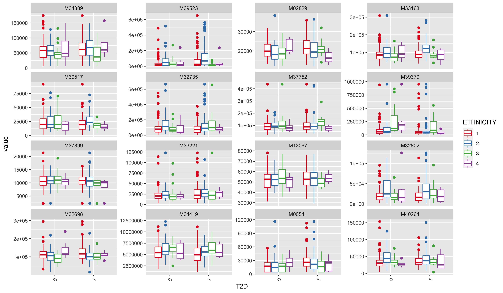

``` r
# select three metabolites
plot_Metabolite(df_plasma_QC, x = "T2D", plot = "boxplot", feature_name = c("M43027",  "M11953", "M38002"))
```

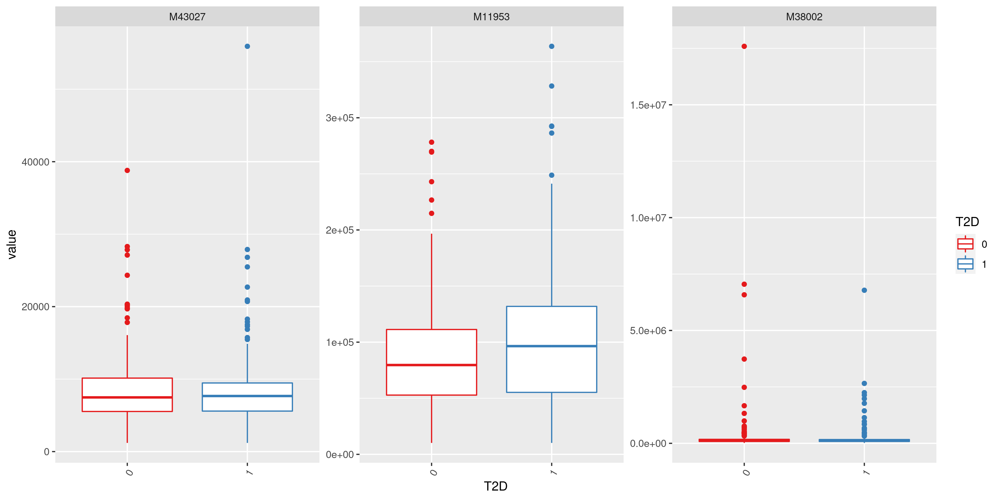

## Visualization: comparisons between groups

``` r
# comparisons between groups using `ggbetweenstats`
plot_Metabolite(df_plasma_QC, x = "T2D", plot = "betweenstats",  feature_name = c("M43027",  "M11953"))
```

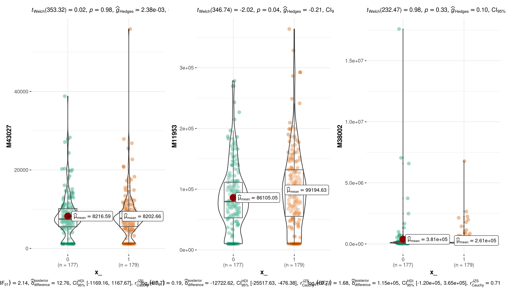

##### After transformation

``` r
plot_Metabolite(df_plasma_scale, plot = "boxplot", x = "T2D", color ="ETHNICITY", shape = "T2D")
```

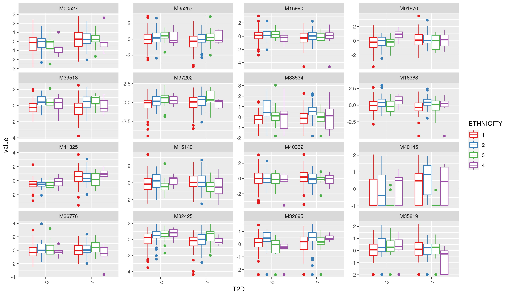

## Visualization: histogram

``` r
plot_Metabolite(df_plasma_scale, plot = "histogram", color = "T2D")
```

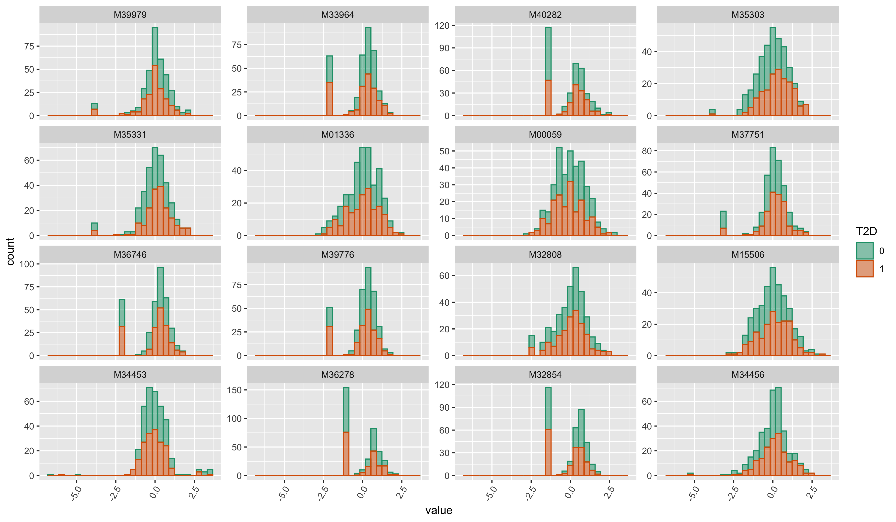

``` r
plot_Metabolite(df_plasma_scale, plot = "histogram", color = "ETHNICITY")
```

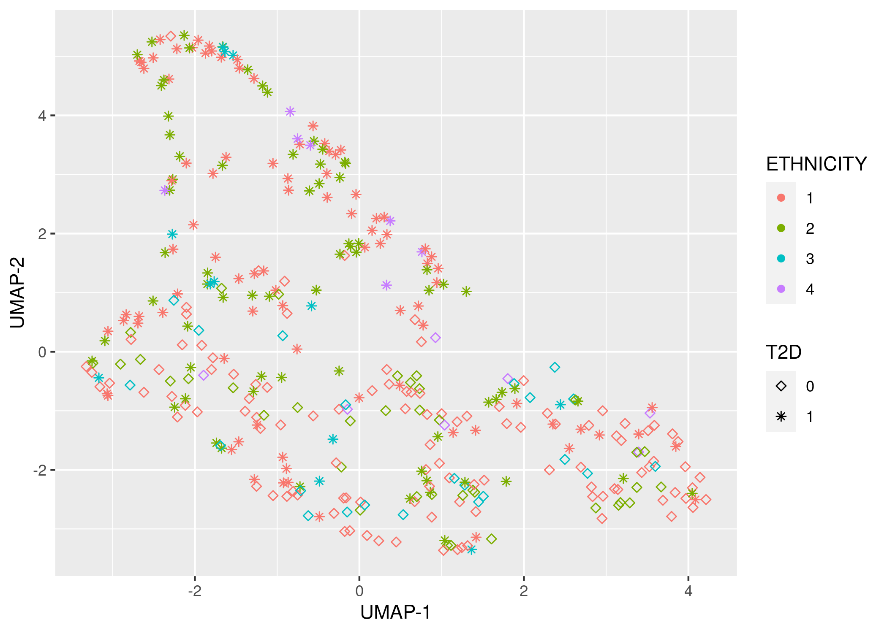

## Normalization

Normalization of metabolomic data is an important step to remove
systematic variation, and to facilitate the identification of real
biological metabolites. Here we provided several commonly used
normalization method, including batch-based normalization, QC
sample-based/nearest QC sample-based normalization, and LOESS
normalization. The latter three methods are used when the measurements
of internal QC samples are available.

<details>
<summary>
**click to show urine toy example for normalization **
</summary>

``` r
# Take the urine data for example, the batch of the samples are missing. To illustrate the usage of the normalization method data, we assume that 120 samples in each batch. 
unique(df_urine_QC@featureData$PLATFORM)
#>  [1] "GC/MS"     "LC/MS Neg" "LC/MS Pos"

# add new columns by reference (column name uppercase)
sampleData(df_urine_QC)[, `GC/MS` := rep(1:3, each = 120)[1:359]]
df_urine_QC@sampleData[, `LC/MS NEG` := rep(1:3, each = 120)[1:359]]
df_urine_QC@sampleData[, `LC/MS POS` := rep(1:3, each = 120)[1:359]]

# we also added a injection order column (in the current order)
df_urine_QC <- update_Metabolite(df_urine_QC, df_urine_QC@sampleData[, 1], action = "injection_order")
#>  Creat a new column `ID_injection_order`.

# and set one as QC samples for each 10 samples. 

df_urine_QC@sampleData[, QCsample := ifelse(1:359%%10 == 0, 1, 0)]
df_urine_QC@sampleData[, QCsample := factor(QCsample, levels = c(1, 0))]
                       
df_urine_QC@sampleData[, `QMDiab-ID` := ifelse(1:359 %% 10 == 0, paste0("MTRX-", `QMDiab-ID`), `QMDiab-ID`)]

table(df_urine_QC@sampleData$QCsample)
#>  
#>    1   0 
#>   35 324

df_urine_QC@assayData$`QMDiab-ID` <- df_urine_QC@sampleData$`QMDiab-ID` # also change the ID in assayData
df_urine_QC
#>  An object of  Metabolite 
#>  
#>  ***  @assayData (first and last 10 columns [ 359  *  787 ])  ***
#>       QMDiab-ID   M38002 M34404  M32391 M20675   M21049  M34400 M40506  M34455
#>    1: QMDiab254  1189337 146900  265120  53499 15379982  619745  53261  227263
#>    2: QMDiab290  9944836 716781 2042008  71989 26406420 1988553 123129 1221563
#>    3:  QMDiab54   926350 182438  775726  48752  7551248 1159521  72837  215868
#>    4:  QMDiab55   305459 579097  511122  21423  4655848 1102500 131674      NA
#>    5: QMDiab319   574761 295176  175826  91788  2762680  417870  21631  243512
#>   ---                                                                         
#>  355:  QMDiab70  1139559 117975  326903     NA 10051449  406266 234997  183234
#>  356: QMDiab118  1517228 234288      NA  24350  2613189  375914  51929      NA
#>  357:  QMDiab65  1028291 352068  609710 113673 29650920  621166 130037  549992
#>  358: QMDiab248  1807105 338741  148964  62614   937893  603113  48151  293379
#>  359:   QMDiab4 10103832 203176  245175  50822 28406416  243598  74996  696766
#>         M30460 M41595 M41702 M41709 M41768 M41837 M42272 M42314 M42335 M42352
#>    1:  5502123  74988  29007   4223  17008   5636  96913  31056  33430  35558
#>    2: 17475172  66278 101935  34251  14937   9552 124745  66036  39595 652059
#>    3:  6423459  74225  51295  14090  32971   9104  44266  23363  39645  62630
#>    4:  4246983  63809  31054   6151   8054  15148  77365  40193  46686  92981
#>    5:  2780633  40804   8307   3715  31370   5993  24081  16319  25583  31037
#>   ---                                                                        
#>  355:  1407294  67664  36157     NA  29194  15652  54919  52317  78413  38453
#>  356:  1856043  34332  29877  30817   5029   4603  42309  17973  25751  12967
#>  357: 10131966  57310  22374     NA  19358   9598 110335  40228  34299 108341
#>  358:       NA  26670   8525   7059  13231   9698  36055  29644  22465  19287
#>  359: 27087992  95140  66285  20229  35845  18570 185546  45205  60944 149210
#>       M42856 M42913
#>    1:  23369  21931
#>    2:  28220  27811
#>    3:  13148  25018
#>    4:  22845  23620
#>    5:  29122  41337
#>   ---              
#>  355:  33084 195136
#>  356:  15268  31577
#>  357:  52714  33244
#>  358:  27299  36462
#>  359:  35991 186372
#>  
#>  ***  @featureData (ID:  featureID ) ***
#>       PATHWAY_SORTORDER                  BIOCHEMICAL SUPER_PATHWAY
#>    1:               986              1,2-propanediol         Lipid
#>    2:              1805         1,3,7-trimethylurate   Xenobiotics
#>    3:              1802            1,3-dimethylurate   Xenobiotics
#>    4:               583 1,5-anhydroglucitol (1,5-AG)  Carbohydrate
#>    5:               591           1,6-anhydroglucose  Carbohydrate
#>   ---                                                             
#>  887:              <NA>                    X - 19380          <NA>
#>  888:              <NA>                    X - 19437          <NA>
#>  889:              <NA>                    X - 19556          <NA>
#>  890:              <NA>                    X - 19573          <NA>
#>  891:              <NA>                    X - 19574          <NA>
#>                                            SUB_PATHWAY COMP_ID  PLATFORM
#>    1:                                    Ketone bodies   38002     GC/MS
#>    2:                              Xanthine metabolism   34404 LC/MS Neg
#>    3:                              Xanthine metabolism   32391     GC/MS
#>    4: Glycolysis, gluconeogenesis, pyruvate metabolism   20675 LC/MS Neg
#>    5: Glycolysis, gluconeogenesis, pyruvate metabolism   21049     GC/MS
#>   ---                                                                   
#>  887:                                             <NA>   42856 LC/MS Neg
#>  888:                                             <NA>   42913 LC/MS Neg
#>  889:                                             <NA>   43112 LC/MS Pos
#>  890:                                             <NA>   43129 LC/MS Neg
#>  891:                                             <NA>   43130 LC/MS Neg
#>                       RI               MASS  PUBCHEM        CAS   KEGG   HMDb_ID
#>    1:               1041                117     <NA>   57-55-6; C00583 HMDB01881
#>    2:               1988              209.1    79437 5415-44-1; C16361 HMDB02123
#>    3:               1937 325.10000000000002    70346 944-73-0 ;   <NA> HMDB01857
#>    4:                808 163.19999999999999     <NA>  154-58-5; C07326 HMDB02712
#>    5:             1679.5              204.1 11412545  498-07-7;   <NA> HMDB00640
#>   ---                                                                           
#>  887:               2287              412.4     <NA>       <NA>   <NA>      <NA>
#>  888: 1150.0999999999999              397.1     <NA>       <NA>   <NA>      <NA>
#>  889: 4249.8999999999996              404.9     <NA>       <NA>   <NA>      <NA>
#>  890:             3906.5              403.2     <NA>       <NA>   <NA>      <NA>
#>  891:             4045.7 307.10000000000002     <NA>       <NA>   <NA>      <NA>
#>       COMP_IDstr featureID
#>    1:     M38002    M38002
#>    2:     M34404    M34404
#>    3:     M32391    M32391
#>    4:     M20675    M20675
#>    5:     M21049    M21049
#>   ---                     
#>  887:     M42856    M42856
#>  888:     M42913    M42913
#>  889:     M43112    M43112
#>  890:     M43129    M43129
#>  891:     M43130    M43130
#>  
#>  ***  @sampleData (ID:  QMDiab-ID ) ***
#>       QMDiab-ID      AGE GENDER      BMI ETHNICITY T2D GC/MS LC/MS NEG LC/MS POS
#>    1: QMDiab254 53.10335      0 32.05128         1   0     1         1         1
#>    2: QMDiab290 39.79192      1 30.51426         4   0     1         1         1
#>    3:  QMDiab54 36.82136      0 24.16831         1   0     1         1         1
#>    4:  QMDiab55 34.75975      0 44.44444         1   1     1         1         1
#>    5: QMDiab319 50.17933      1 27.18090         1   1     1         1         1
#>   ---                                                                           
#>  355:  QMDiab70 35.40315      1 33.83403         1   1     3         3         3
#>  356: QMDiab118 49.06229      1 25.64494         1   0     3         3         3
#>  357:  QMDiab65 47.22245      1 23.38435         1   0     3         3         3
#>  358: QMDiab248 56.39151      0 27.58621         1   1     3         3         3
#>  359:   QMDiab4 24.22450      0 41.66521         1   0     3         3         3
#>       ID_injection_order QCsample
#>    1:                  1        0
#>    2:                  2        0
#>    3:                  3        0
#>    4:                  4        0
#>    5:                  5        0
#>   ---                            
#>  355:                355        0
#>  356:                356        0
#>  357:                357        0
#>  358:                358        0
#>  359:                359        0
#>  
#>  ***  @miscData  ***
#>  list()
#>  
#>  ***  @logs  ***
#>  06/03/22 09:48:23: Import data from: /Library/Frameworks/R.framework/Versions/4.1/Resources/library/metabolomicsR/extdata/QMDiab_metabolomics_OrigScale.xlsx .
#>  06/03/22 09:48:23: Initiate data: 359 samples and 891 features.
#>  06/03/22 09:48:23: Update data, action: change_featureID, 359 samples and 891 features. 
#>  
#>  06/03/22 09:48:24: Run QC pipeline.
#>  06/03/22 09:48:24: Filter data with a constant column, removed 28 features. 
#>  06/03/22 09:48:24: Update data, 359 samples and 891 features. 
#>  06/03/22 09:48:24: Filter data with a missing rate >= 0.5, removed 77 features. 
#>  06/03/22 09:48:24: Update data, 359 samples and 891 features. 
#>  06/03/22 09:48:25: Replace outliers using `winsorize` method 5 SDs. 
#>  06/03/22 09:48:50: Update data, action: injection_order, 359 samples and 891 features.
```

</details>

We then selected the first 16 metabolites to show boxplot

``` r
v_features <- df_urine_QC@featureData$featureID[1:16]

plot_injection_order(df_urine_QC, color = "QCsample", shape = "GC/MS", feature_name = v_features)
```

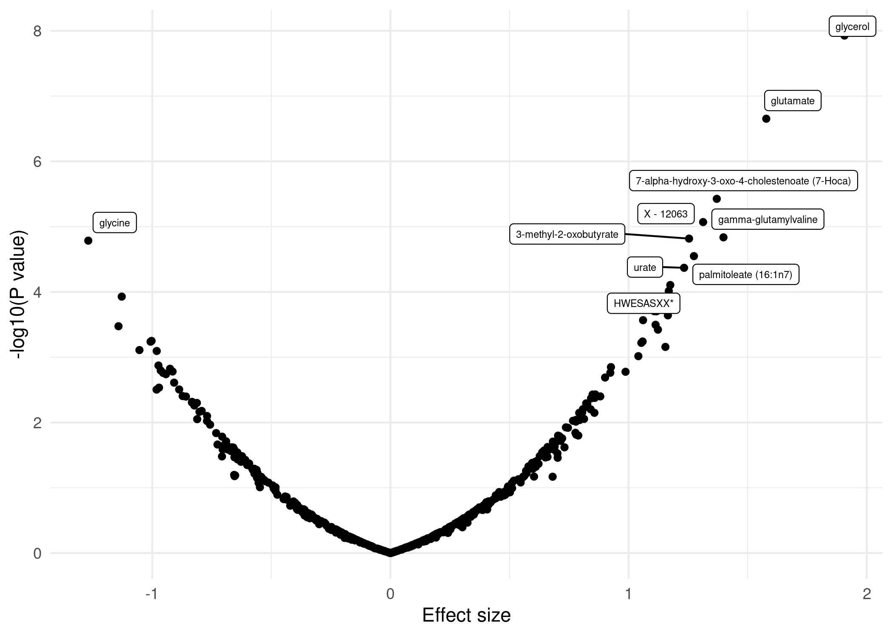

## Normalization 1: batch-norm

``` r
df_urine_QC_norm <- batch_norm(df_urine_QC)
#>  
#>  Platform information in @featureData:
#>  platforms
#>      GC/MS LC/MS Neg LC/MS Pos 
#>        154       417       320 
#>  
#>  
#>  Sample size in platform GC/MS
#>    1   2   3 
#>  120 120 119
p1 <- plot_injection_order(df_urine_QC_norm, color = "QCsample", shape = "GC/MS", feature_name = v_features)
p1
```

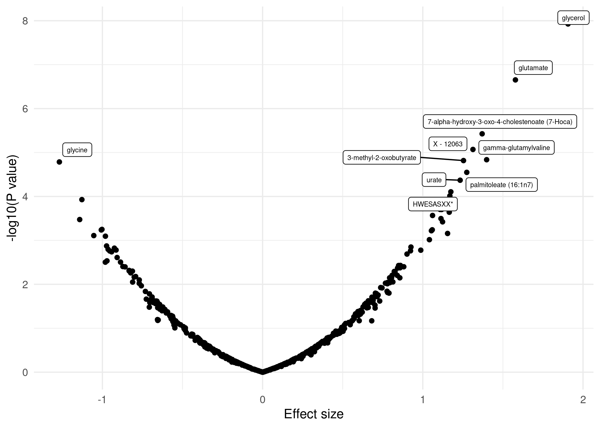

<details>
<summary>
**click to show other normalization methods **
</summary>

## Normalization 2: QCmatrix_norm

``` r
df_urine_QC_norm <- QCmatrix_norm(df_urine_QC)
#>  
#>  Platform information in @featureData:
#>  platforms
#>      GC/MS LC/MS Neg LC/MS Pos 
#>        154       417       320 
#>  
#>  
#>  Sample size in platform GC/MS
#>    1   2   3 
#>  120 120 119 
#>  
#>  
#>   Number of QC samples n = 35
p2 <- plot_injection_order(df_urine_QC_norm, color = "QCsample", shape = "GC/MS", feature_name = v_features)
p2
```

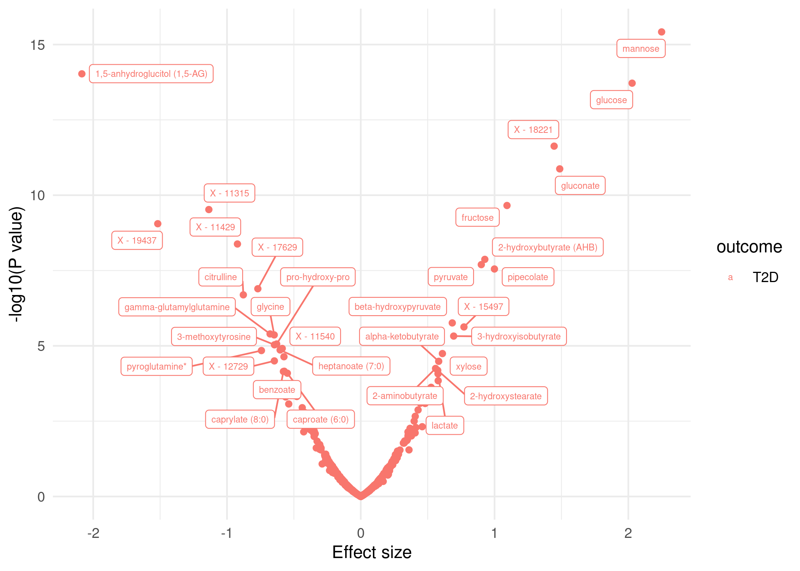

## Normalization 3: nearestQC_norm

``` r
df_urine_QC_norm <- nearestQC_norm(df_urine_QC)
#>  
#>  The top ten sample ID (in injection order):
#>  QMDiab254, QMDiab290, QMDiab54, QMDiab55, QMDiab319, QMDiab255, QMDiab190, QMDiab247, QMDiab209, MTRX-QMDiab94 
#>  
#>  Platform information in @featureData:
#>  platforms
#>      GC/MS LC/MS Neg LC/MS Pos 
#>        154       417       320 
#>  
#>  
#>  Sample size in platform GC/MS
#>    1   2   3 
#>  120 120 119 
#>  
#>  
#>   Number of QC samples n = 35
p3 <- plot_injection_order(df_urine_QC_norm, color = "QCsample", shape = "GC/MS", feature_name = v_features)
p3
```

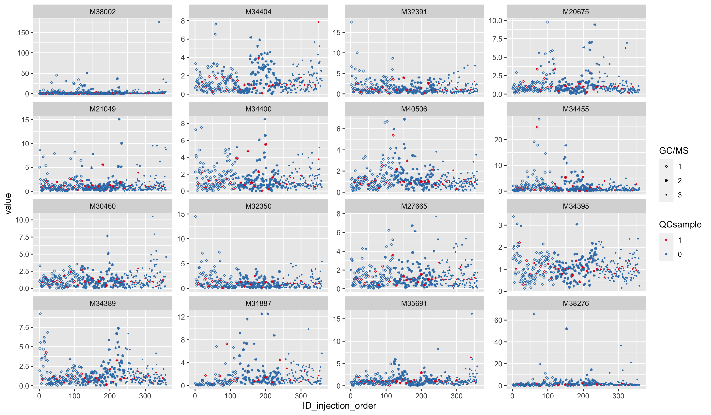

## Normalization 4: modelling_norm

``` r
df_urine_QC_norm_LOESS <- modelling_norm(df_urine_QC, method = "LOESS")
#>  
#>  Platform information in @featureData:
#>  platforms
#>      GC/MS LC/MS Neg LC/MS Pos 
#>        154       417       320 
#>  
#>  
#>  Sample size in platform GC/MS
#>    1   2   3 
#>  120 120 119 
#>  
#>  
#>   Number of QC samples n = 35
p4 <- plot_injection_order(df_urine_QC_norm, color = "QCsample", shape = "GC/MS", feature_name = v_features)
p4
```

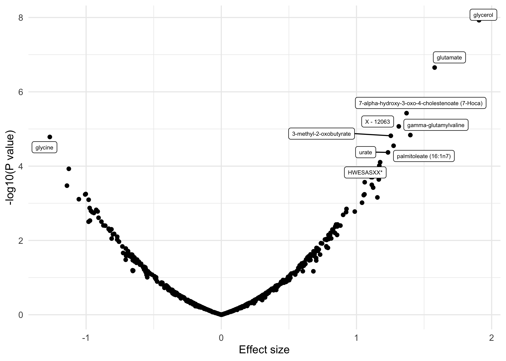

``` r

df_urine_QC_norm_KNN <- modelling_norm(df_urine_QC, method = "KNN", k = 3)
#>  
#>  Platform information in @featureData:
#>  platforms
#>      GC/MS LC/MS Neg LC/MS Pos 
#>        154       417       320 
#>  
#>  
#>  Sample size in platform GC/MS
#>    1   2   3 
#>  120 120 119 
#>  
#>  
#>   Number of QC samples n = 35
p5 <- plot_injection_order(df_urine_QC_norm_KNN, color = "QCsample", shape = "GC/MS", feature_name = v_features)
p5
```

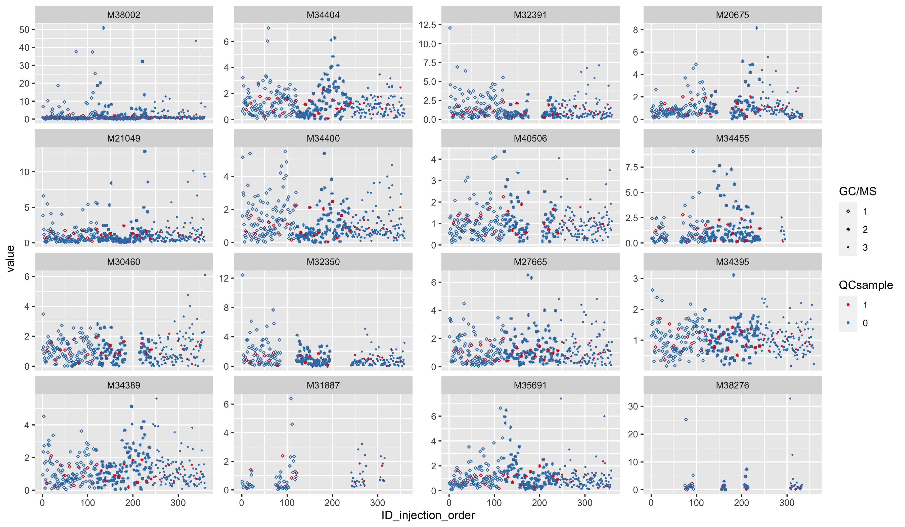
</details>

## Dimensional reduction

Dimensional reduction strategies on metabolites data can be used to
detect batch effects, sample outliers, and real biological subgroups. We
included principal components analysis (PCA), manifold approximation and
projection (UMAP), and t-distributed stochastic neighbor embedding
(tSNE) methods. Figures will be displayed in ggplot2 style.

``` r
df_plasma_PCA <- run_PCA(df_plasma_QC)

plot_PCA(df_plasma_PCA, color ="ETHNICITY", shape = "T2D")
```

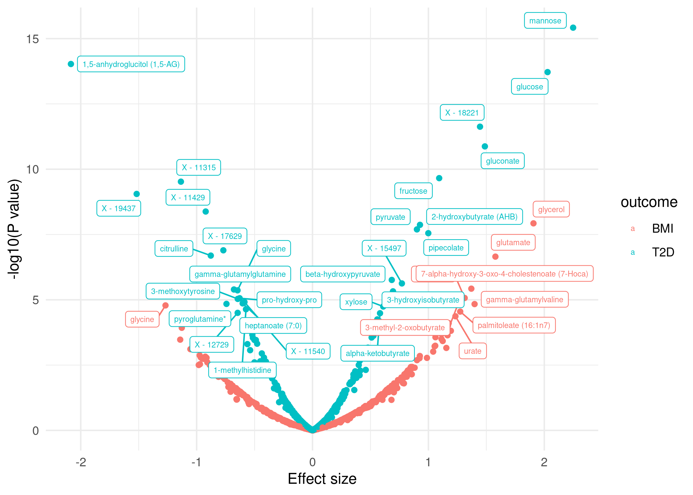

``` r
plot_UMAP(df_plasma_QC, color ="ETHNICITY", shape = "T2D")
```

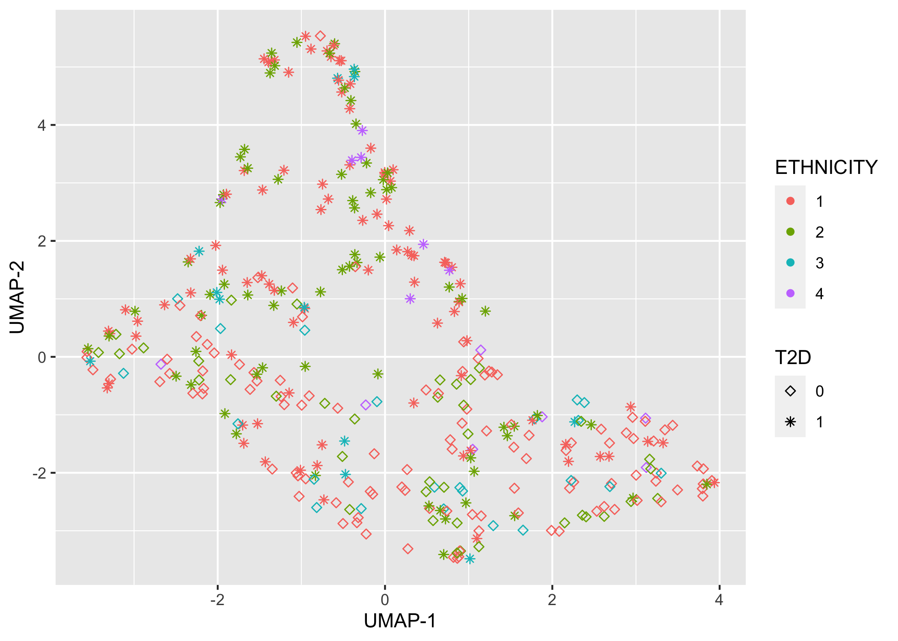

``` r
plot_tsne(df_plasma_QC, color ="ETHNICITY", shape = "T2D")
```

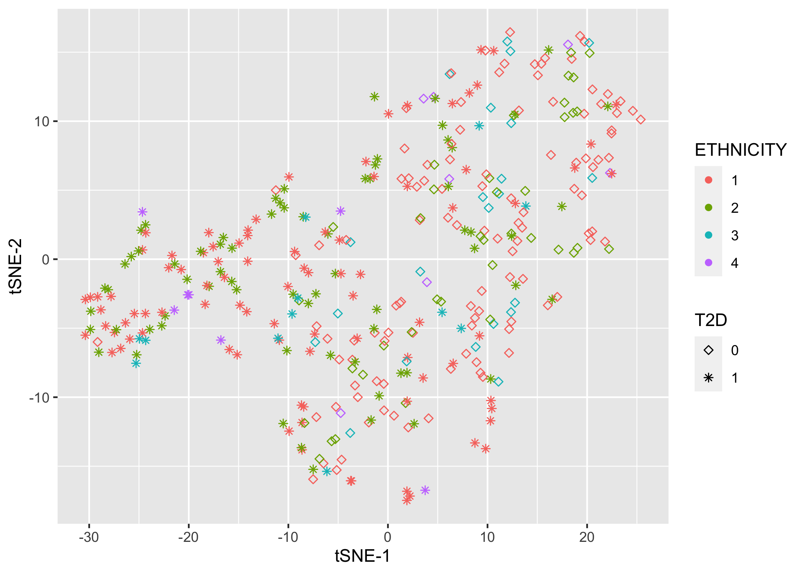

## Correlation

``` r
# pairwise correlation of metabolites between two different fluids

# plasma vs urine
dd <- correlation(df_plasma_QC, df_urine_QC, method = "spearman")
#>  Identify  356  samples in data A, and  359  samples in data B, with  312  overlap samples.
#>  Identify  545  features in data A, and  786  features in data B, with  248  overlap features.
dd <- merge(dd, df_plasma_QC@featureData, by.x = "term", by.y = "featureID")

p <- ggplot(dd, aes(x = SUPER_PATHWAY, y = r, fill = SUPER_PATHWAY)) +
  geom_boxplot() +
  geom_jitter( size=0.4, alpha=0.9) +
  scale_fill_manual(values = RColorBrewer::brewer.pal(9, "Set1")) +
  theme(axis.text.x = element_text(angle = 60, hjust = 1))+
  labs(title = "plasma vs urine")

p
```

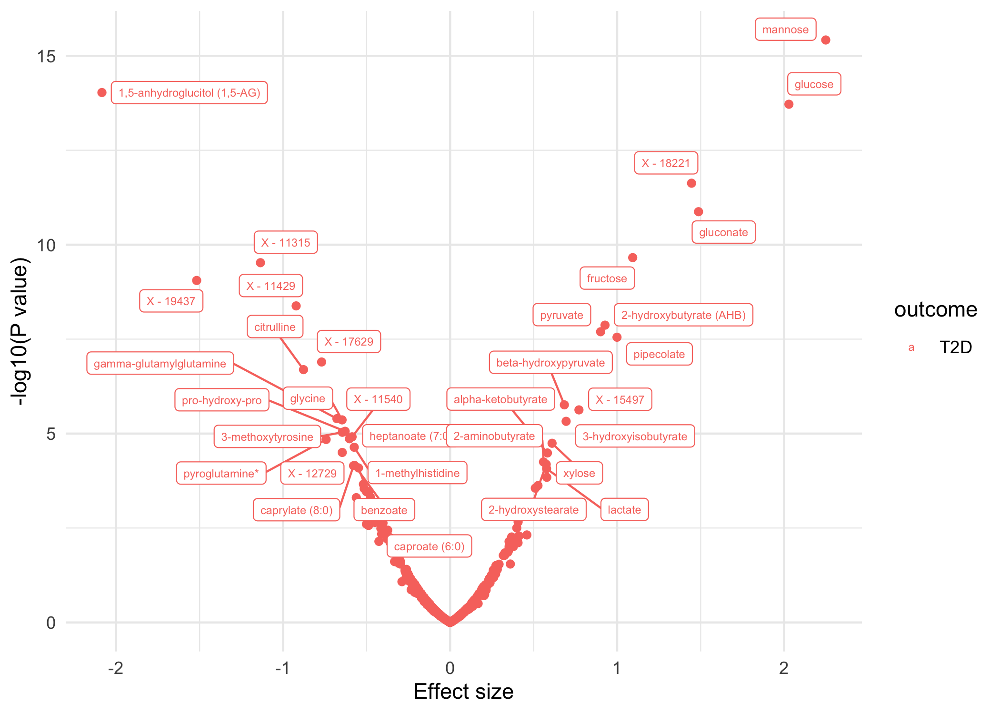

<details>
<summary>
**click to show plasma vs saliva & urine vs saliva**
</summary>

``` r
# plasma vs saliva
dd <- correlation(df_plasma_QC, df_saliva_QC, method = "spearman")
#>  Identify  356  samples in data A, and  321  samples in data B, with  319  overlap samples.
#>  Identify  545  features in data A, and  364  features in data B, with  137  overlap features.
dd <- merge(dd, df_plasma_QC@featureData, by.x = "term", by.y = "featureID")

p2 <- ggplot(dd, aes(x = SUPER_PATHWAY, y = r, fill = SUPER_PATHWAY)) +
  geom_boxplot() +
  geom_jitter(size=0.4, alpha=0.9) +
  scale_fill_manual(values = RColorBrewer::brewer.pal(9, "Set1")) +
  theme(axis.text.x = element_text(angle = 60, hjust = 1)) +
  labs(title = "plasma vs saliva")


# urine vs saliva
dd <- correlation(df_urine_QC, df_saliva_QC, method = "spearman")
#>  Identify  359  samples in data A, and  321  samples in data B, with  282  overlap samples.
#>  Identify  786  features in data A, and  364  features in data B, with  155  overlap features.
dd <- merge(dd, df_urine_QC@featureData, by.x = "term", by.y = "featureID")

p3 <- ggplot(dd, aes(x = SUPER_PATHWAY, y = r, fill = SUPER_PATHWAY)) +
  geom_boxplot() +
  geom_jitter(size=0.4, alpha=0.9) +
   scale_fill_manual(values = RColorBrewer::brewer.pal(9, "Set1")) +
  theme(axis.text.x = element_text(angle = 60, hjust = 1)) +
  labs(title = "urine vs saliva")


p <- cowplot::plot_grid(p2, p3, nrow = 1)
p
```

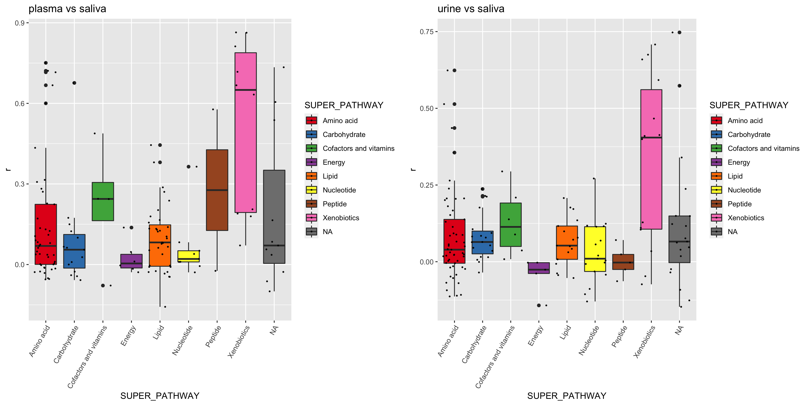
</details>

## Association analysis 1: linear regression

Association analysis between metabolites and interested outcomes was
implemented in the “regression” function, supporting general linear
regression, logistic regression, poisson regression, proportional
hazards regression model, linear mixed-effects model, and logistic
linear mixed-effects model, with or without covariates. All the
regression models can be run for selected metabolites or all metabolites
in a single job with the support of parallel computing.

``` r
fit_lm <- regression(object = df_plasma_scale, phenoData = NULL, model = "lm", outcome = "BMI",
                          covars = c("AGE", "GENDER", "ETHNICITY"), factors = "ETHNICITY")
#>  Regression for 1 outcome(s). 
#>  
#>  Build formula using covars and outcomes. 
#>  
#>  Run `lm` model for 545 features: 
#>  BMI ~ AGE + GENDER + ETHNICITY + `feature`

head(fit_lm)
#>       term     estimate std.error   statistic   p.value   n outcome p.value.adj
#>  1: M43027 -0.287065678 0.2909369 -0.98669400 0.3244762 356     BMI           1
#>  2: M11953  0.285148910 0.2945365  0.96812761 0.3336511 356     BMI           1
#>  3: M38002  0.063510129 0.2960686  0.21451153 0.8302735 356     BMI           1
#>  4: M34404  0.459471416 0.3109698  1.47754337 0.1404319 356     BMI           1
#>  5: M35963 -0.008355339 0.2942752 -0.02839294 0.9773650 356     BMI           1
#>  6: M35728  0.280617622 0.2929012  0.95806251 0.3386944 356     BMI           1
```

``` r
dd <- merge(fit_lm, df_plasma_scale@featureData, by.x = "term", by.y = "featureID")

dd[, sig := ifelse(p.value.adj < 0.1, 1, 0)]
plot_volcano(dd, color = NULL, label = "BIOCHEMICAL")
```

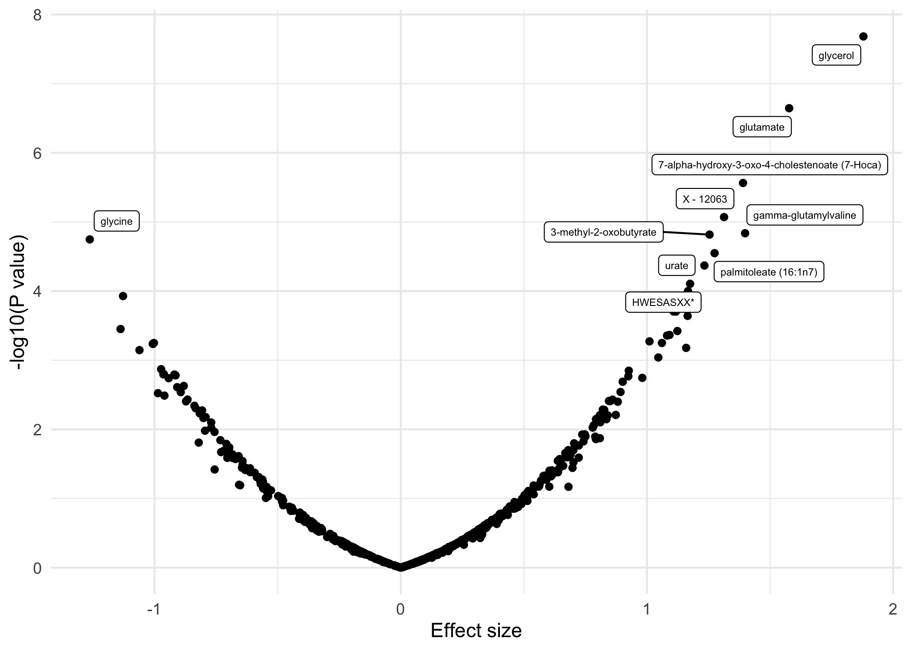

## Association analysis 2: logistic regression

``` r
fit_glm <- regression(object = df_plasma_scale, phenoData = NULL, model = "logistic", outcome = "T2D",
                         covars = c("AGE","GENDER", "ETHNICITY"), factors = "ETHNICITY")
#>  Regression for 1 outcome(s). 
#>  
#>  Build formula using covars and outcomes. 
#>  
#>  Run `logistic` model for 545 features: 
#>  T2D ~ AGE + GENDER + ETHNICITY + `feature`

head(fit_glm)
#>       term    estimate std.error   statistic    p.value   n outcome p.value.adj
#>  1: M43027 -0.01513772 0.1249949 -0.12110676 0.90360647 356     T2D           1
#>  2: M11953  0.07313020 0.1258779  0.58096115 0.56126664 356     T2D           1
#>  3: M38002  0.01273692 0.1286644  0.09899333 0.92114357 356     T2D           1
#>  4: M34404  0.02452545 0.1413296  0.17353372 0.86223193 356     T2D           1
#>  5: M35963  0.35664968 0.1338055  2.66543322 0.00768892 356     T2D           1
#>  6: M35728  0.01557804 0.1306566  0.11922888 0.90509402 356     T2D           1
```

``` r
dd <- merge(fit_glm, df_plasma_scale@featureData, by.x = "term", by.y = "featureID")

dd[, sig := ifelse(p.value.adj < 0.1, 1, 0)]

plot_volcano(dd, label = "BIOCHEMICAL")
```

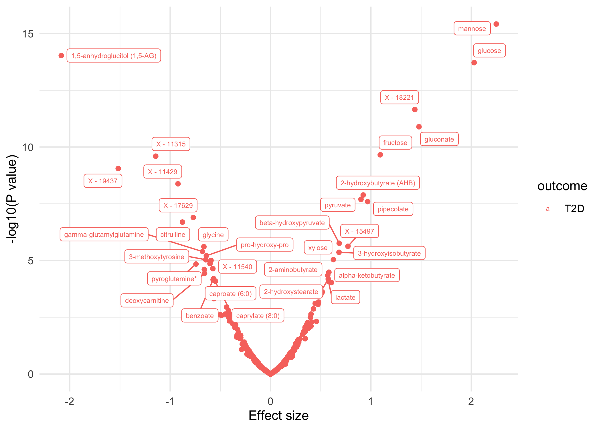

## Association analysis 3: multiple outcomes, using model = “auto”

``` r
fit2 <- regression(object = df_plasma_scale, phenoData = NULL, model = "auto", outcome = c("BMI", "T2D"),
                         covars = c("AGE","GENDER", "ETHNICITY"), factors = "ETHNICITY")
#>  Regression for 2 outcome(s). 
#>  
#>  Build formula using covars and outcomes. 
#>  model = `auto`, to infer `lm` or `logistic` 
#>  
#>  Run `lm` model for 545 features: 
#>  BMI ~ AGE + GENDER + ETHNICITY + `feature` 
#>  Build formula using covars and outcomes. 
#>  model = `auto`, to infer `lm` or `logistic` 
#>  
#>  Run `logistic` model for 545 features: 
#>  T2D ~ AGE + GENDER + ETHNICITY + `feature`

head(fit2)
#>       term     estimate std.error   statistic   p.value   n outcome p.value.adj
#>  1: M43027 -0.287065678 0.2909369 -0.98669400 0.3244762 356     BMI           1
#>  2: M11953  0.285148910 0.2945365  0.96812761 0.3336511 356     BMI           1
#>  3: M38002  0.063510129 0.2960686  0.21451153 0.8302735 356     BMI           1
#>  4: M34404  0.459471416 0.3109698  1.47754337 0.1404319 356     BMI           1
#>  5: M35963 -0.008355339 0.2942752 -0.02839294 0.9773650 356     BMI           1
#>  6: M35728  0.280617622 0.2929012  0.95806251 0.3386944 356     BMI           1
```

``` r
dd2 <- merge(fit2, df_plasma_scale@featureData, by.x = "term", by.y = "featureID")

dd2[, sig := ifelse(p.value.adj < 0.1, 1, 0)]
plot_volcano(dd2, color = "outcome", label = "BIOCHEMICAL")
```

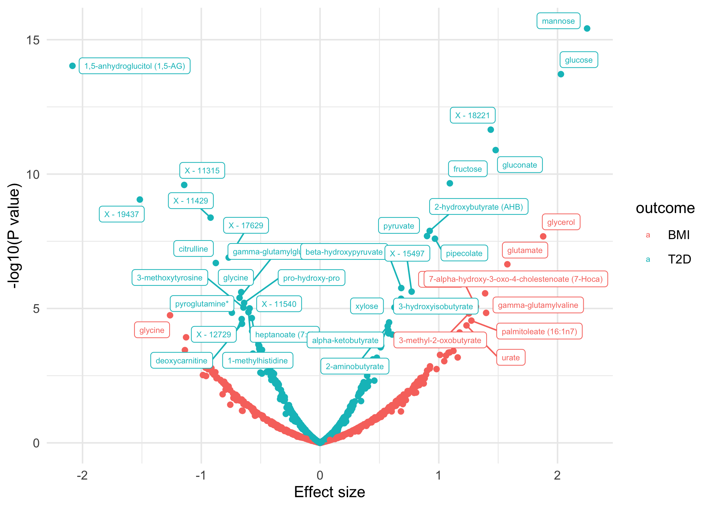

## Association analysis 4: extension to other regression models

We have provided various regression models in the `{metabolomicsR}`
package. Here we show how to extend the `regression` function to other
regression models.

``` r
# for example, to fit a Negative Binomial Generalized Linear Model, we first define a `fit_glm.nb` function. 

library(MASS)

fit_glm.nb <- function(data = NULL, formula = NULL, keep = NULL) {
  v_var <- all.vars(formula)
  df <- data[, v_var, with = FALSE]
  fit <- tryCatch(
    do.call("glm.nb", args = list(data = df, formula = formula)),
    error = function(e) {
      cat(paste0("Failed to fit model: ", e), "\n")
    })
  if(inherits(fit, "glm")) {
    res  <- as.data.table(broom::tidy(fit))
    if(! is.null(keep)) res <- res[res$term %in% keep, ]
    res$n <- length(fit$residuals)
  } else {
    res <- list(estimate = NA)
  }
  return(res)
}

# the outcome 'toy_y' was only created to demonstrate the usage to extend regression models

sampleData(df_plasma_scale)[, toy_y := round(BMI, 0)]

# equivalent to:
if(0) {
  dd <- sampleData(df_plasma_scale) 
  dd[, toy_y := round(BMI, 0)]
  sampleData(df_plasma_scale)  <- dd
}

fit <- regression(object = df_plasma_scale, phenoData = NULL, model = "glm.nb", outcome = "toy_y",
                  covars = c("AGE","GENDER", "ETHNICITY"), factors = "ETHNICITY", 
                  feature_name = df_plasma_scale@featureData$featureID[1:50])
#>  Regression for 1 outcome(s). 
#>  
#>  Build formula using covars and outcomes. 
#>  
#>  Run `glm.nb` model for 50 features: 
#>  toy_y ~ AGE + GENDER + ETHNICITY + `feature`
```

``` r
dd <- merge(fit, df_plasma_scale@featureData, by.x = "term", by.y = "featureID")
dd[, sig := ifelse(p.value.adj < 0.1, 1, 0)]
plot_volcano(dd, color = NULL, label = "BIOCHEMICAL")
```

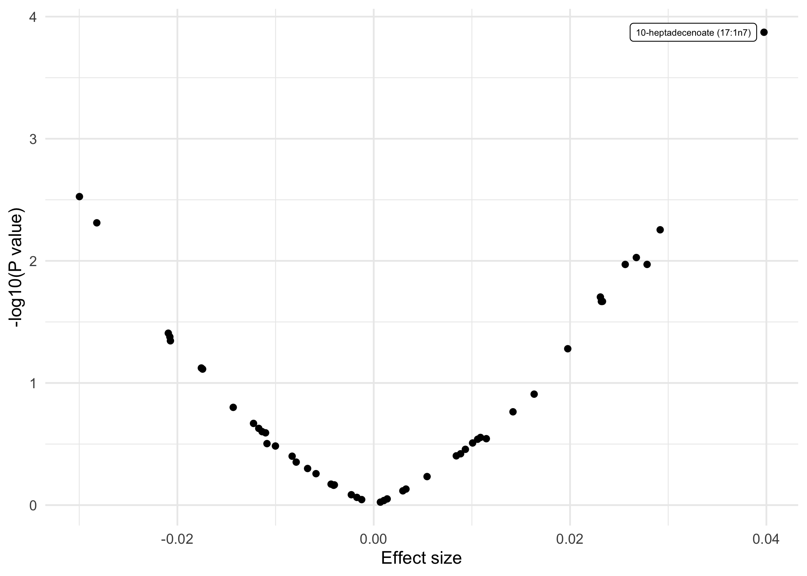

## ROC

``` r
library(plotROC)

# ROC for one variable, to add a wrapped for many metabolites separately
plot_ROC(object = df_plasma_scale, y = "T2D", x = "M00527")
```

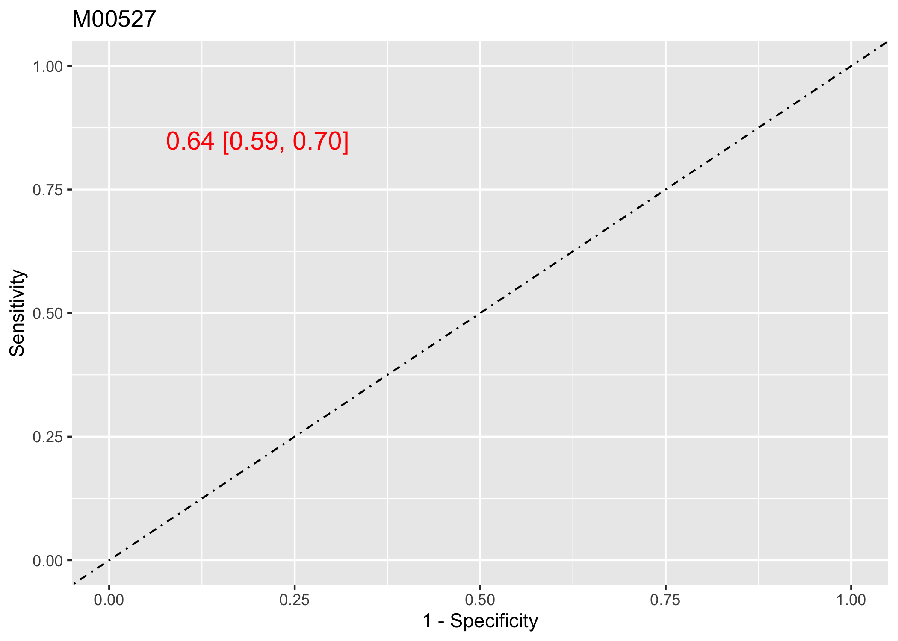

``` r
plot_ROC(object = df_plasma_scale, y = "T2D", x = c("M00527", "BMI"))
```

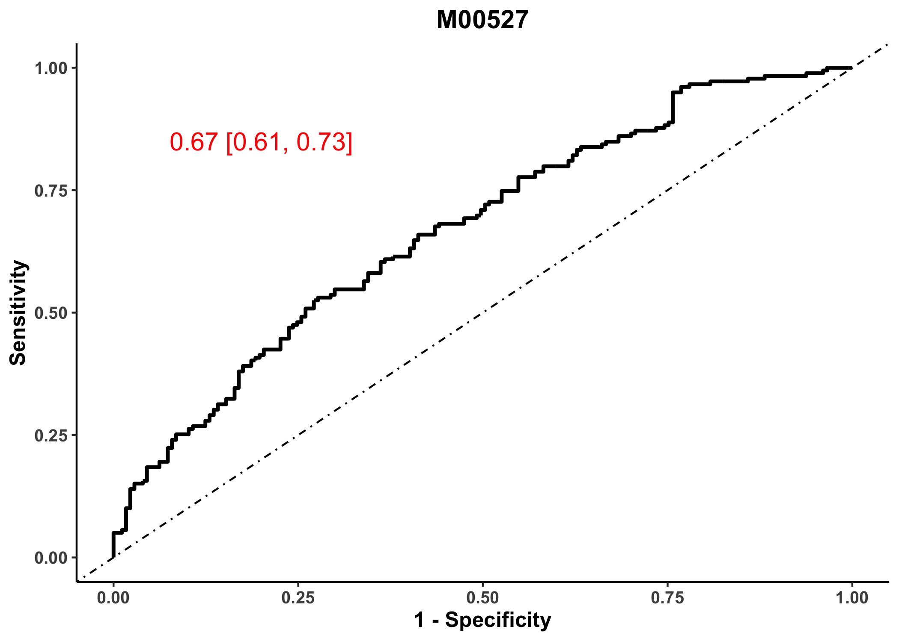

## ROC 2: compare two models:

``` r
plot_ROC(object = df_plasma_scale, y = "T2D", 
         model_a = c("BMI", "AGE", "GENDER"), 
         model_b = c("M00527", "BMI", "AGE", "GENDER"))
```

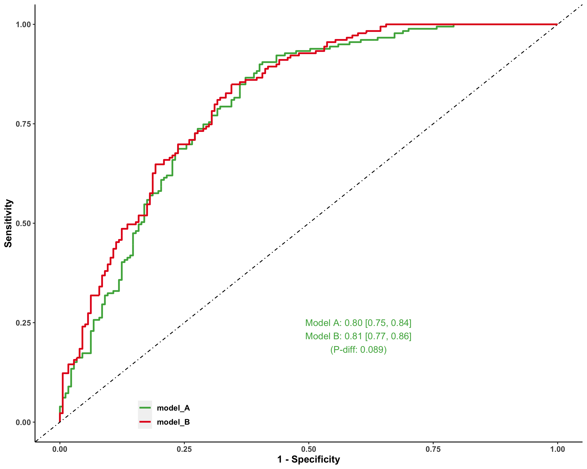

<details>
<summary>
**Session Info**
</summary>

``` r
sessionInfo()
#>  R version 4.1.2 (2021-11-01)
#>  Platform: x86_64-apple-darwin17.0 (64-bit)
#>  Running under: macOS Big Sur 10.16
#>  
#>  Matrix products: default
#>  BLAS:   /Library/Frameworks/R.framework/Versions/4.1/Resources/lib/libRblas.0.dylib
#>  LAPACK: /Library/Frameworks/R.framework/Versions/4.1/Resources/lib/libRlapack.dylib
#>  
#>  locale:
#>  [1] en_US.UTF-8/en_US.UTF-8/en_US.UTF-8/C/en_US.UTF-8/en_US.UTF-8
#>  
#>  attached base packages:
#>  [1] stats     graphics  grDevices utils     datasets  methods   base     
#>  
#>  other attached packages:
#>  [1] MASS_7.3-54         plotROC_2.2.1       cowplot_1.1.1      
#>  [4] ggplot2_3.3.5       data.table_1.14.2   metabolomicsR_0.1.0
#>  
#>  loaded via a namespace (and not attached):
#>    [1] insight_0.16.0         doParallel_1.0.17      RColorBrewer_1.1-2    
#>    [4] backports_1.4.1        tools_4.1.2            utf8_1.2.2            
#>    [7] R6_2.5.1               statsExpressions_1.3.0 DBI_1.1.2             
#>   [10] colorspace_2.0-3       withr_2.5.0            tidyselect_1.1.2      
#>   [13] compiler_4.1.2         progressr_0.10.0       performance_0.8.0     
#>   [16] cli_3.2.0              prismatic_1.1.0        labeling_0.4.2        
#>   [19] bayestestR_0.11.5      scales_1.1.1           mvtnorm_1.1-3         
#>   [22] mc2d_0.1-21            pbapply_1.5-0          askpass_1.1           
#>   [25] stringr_1.4.0          digest_0.6.29          rmarkdown_2.12        
#>   [28] M3C_1.14.0             WRS2_1.1-3             pkgconfig_2.0.3       
#>   [31] htmltools_0.5.2        parallelly_1.30.0      umap_0.2.7.0          
#>   [34] fastmap_1.1.0          highr_0.9              rlang_1.0.2           
#>   [37] readxl_1.3.1           rstudioapi_0.13        FNN_1.1.3             
#>   [40] farver_2.1.0           generics_0.1.2         jsonlite_1.8.0        
#>   [43] gtools_3.9.2           dplyr_1.0.8            magrittr_2.0.2        
#>   [46] parameters_0.16.0      patchwork_1.1.1        Matrix_1.3-4          
#>   [49] Rcpp_1.0.8             munsell_0.5.0          fansi_1.0.2           
#>   [52] reticulate_1.24        lifecycle_1.0.1        pROC_1.18.0           
#>   [55] stringi_1.7.6          yaml_2.3.5             Rtsne_0.15            
#>   [58] plyr_1.8.6             matrixcalc_1.0-5       grid_4.1.2            
#>   [61] paletteer_1.4.0        listenv_0.8.0          parallel_4.1.2        
#>   [64] ggrepel_0.9.1          crayon_1.5.0           doSNOW_1.0.20         
#>   [67] lattice_0.20-45        zeallot_0.1.0          knitr_1.37            
#>   [70] pillar_1.7.0           boot_1.3-28            corpcor_1.6.10        
#>   [73] effectsize_0.6.0.1     reshape2_1.4.4         codetools_0.2-18      
#>   [76] glue_1.6.2             evaluate_0.15          png_0.1-7             
#>   [79] vctrs_0.3.8            foreach_1.5.2          MatrixModels_0.5-0    
#>   [82] cellranger_1.1.0       gtable_0.3.0           openssl_2.0.0         
#>   [85] purrr_0.3.4            BayesFactor_0.9.12-4.3 tidyr_1.2.0           
#>   [88] future_1.24.0          rematch2_2.1.2         reshape_0.8.8         
#>   [91] assertthat_0.2.1       datawizard_0.3.0       xfun_0.29             
#>   [94] broom_0.7.12           correlation_0.8.0      RSpectra_0.16-0       
#>   [97] coda_0.19-4            tibble_3.1.6           snow_0.4-4            
#>  [100] iterators_1.0.14       ggstatsplot_0.9.1      cluster_2.1.2         
#>  [103] globals_0.14.0         ellipsis_0.3.2
```

</details>
