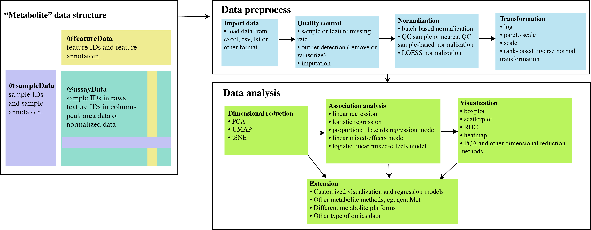

```{r options, include=FALSE, echo=FALSE}

library(BiocStyle)
knitr::opts_chunk$set(warning=FALSE, error=FALSE, message=FALSE)

```

<br>
<strong>`{metabolomicsR}`: Tools to process, analyze, and visualize metabolomic data.</strong>

<strong>metabolomicsR</strong> is a streamlined R package to preprocess, analyze, and visualize metabolomic data. We included a set of functions for sample and metabolite quality control, outlier detection, missing value imputation, dimensional reduction, normalization, data integration, regression analysis, annotation, and visualization of data and results. The <strong>metabolomicsR</strong> is designed to be a comprehensive R package that can be easily used by researchers with basic R programming skills. The framework designed here is also versatile and is extensible to various methods and metabolomic platforms. Here, we demonstrate the step-by-step use of the main functions from this package.

<strong>Figure:</strong> Seamless workflow to preprocess, analyze, and visualize metabolomic data in <strong>metabolomicsR</strong> 

<br>

# Installation

| Type        | Command                                             |
|-------------|-----------------------------------------------------|
| Development | `remotes::install_github("XikunHan/metabolomicsR")` |

<br><br>

# Data structure

We first designed a “Metabolite” class based on the object-oriented programming system S4 in R. For a particular “Metabolite” data, it will include “assayData” (eg. peak area data or batch-normalized data, samples in rows and metabolites in columns), “featureData” (metabolite annotation), “sampleData” (sample annotation), “featureID”, “sampleID”, “logs” (log information of data analysis process), and “miscData” (other ancillary data). For metabolites, current platforms typically measure ~1,000 features. It will be much easier to manipulate the data with samples in rows and metabolites in columns, rather than the `{SummarizedExperiment}` container where the columns represent samples. 

<br><br>

# Import data

To demonstrate the package, we obtained metabolomic data from Qatar Metabolomics Study on Diabetes, similar to the data format from non-targeted mass spectrometry by Metabolon. The dataset is available via [figshare](https://doi.org/10.6084/m9.figshare.5904022).

The data can be imported directly from excel, csv or other formats that imported into R.

```{r}

library(metabolomicsR)
library(data.table)
library(ggplot2)
library(cowplot)
library(plotROC)

# Load the metabolomic dataset from an excel file

file_path <- base::system.file("extdata", "QMDiab_metabolomics_OrigScale.xlsx", package = "metabolomicsR", mustWork = TRUE)

df_plasma <- load_excel(path = file_path,
                        data_sheet = 1,
                        feature_sheet = 4,
                        sample_sheet = 8,
                        sampleID = "QMDiab-ID",
                        featureID = "BIOCHEMICAL"
                        )

# To save the data in disc. 
# save_data(df_plasma, file = "~/test")

```

In the “assayData”, the first column is the sample IDs to match with “sampleData”, the other columns are metabolite IDs to match with “featureData”.

<br>

<details>
<summary>**click to show plasma data**</summary>
```{r}
df_plasma
```
</details>

The `{update_Metabolite}` function provides several methods to update the data, including "injection_order", "keep_feature", "remove_feature", "keep_sample", "remove_sample", "add_sample_annotation", and "change_featureID". 


```{r}
# change the feature ID to the column `COMP_IDstr`
df_plasma <- update_Metabolite(df_plasma, dataset = "COMP_IDstr", action = "change_featureID")

```

<br>

<details>
<summary>**click to show plasma data**</summary>
```{r}
df_plasma
```
</details>

```{r}
# load urine metabolomic data
df_urine <- load_excel(path = file_path,
                        data_sheet = 2,
                        feature_sheet = 5,
                        sample_sheet = 9,
                        sampleID = "QMDiab-ID",
                        featureID = "BIOCHEMICAL"
                        )

df_urine <- update_Metabolite(df_urine, dataset = "COMP_IDstr", action = "change_featureID")
```

<br>

<details>
<summary>**click to show urine data**</summary>
```{r}
df_urine
```
</details>

```{r}
# load saliva metatabolomic data
df_saliva <- load_excel(path = file_path,
                        data_sheet = 3,
                        feature_sheet = 6,
                        sample_sheet = 10,
                        sampleID = "QMDiab-ID",
                        featureID = "BIOCHEMICAL"
                        )

df_saliva <- update_Metabolite(df_saliva, dataset = "COMP_IDstr", action = "change_featureID")
```

<br>
<details>
<summary>**click to show saliva data**</summary>
```{r}
df_saliva
```
</details>

<br><br>

# Quality control pipeline

We provided a pipeline for metabolite and sample quality control (QC) procedures. In the QC pipeline, we included the following functions: remove metabolites or samples beyond a particular missing rate threshold (e.g., 0.5), detect outliers (e.g., ± 5 standard deviations) and replace outliers with missing values or winsorize outliers, and various popular methods to impute missing values (e.g., half of the minimum value, median, zero, or nearest neighbor averaging [kNN] method). All the steps can be customized that have been implemented in the “QC_pipeline” function or be used from each individual function (eg. “filter_column_missing_rate”, “replace_outlier”, and “impute”).


First, we display the QC metrics using the `{plot_QC}` function
```{r, fig.width = 16, fig.height = 12}

p <- plot_QC(df_plasma)
p$p

```


<details>
<summary>**click to show plasma QC metrics**</summary>
```{r}
p
```
</details>


```{r}

df_plasma_QC <- QC_pipeline(df_plasma, replace_outlier_method = "winsorize", impute_method = NULL)

```

<details>
<summary>**click to show plasma data after QC**</summary>
```{r}
df_plasma_QC
```
</details>


For the urine QC metrics
```{r, fig.width = 16, fig.height = 12}
p <- plot_QC(df_urine)
p$p

```


```{r}
df_urine_QC <- QC_pipeline(df_urine, replace_outlier_method = "winsorize", impute_method = NULL)
```

<details>
<summary>**click to show urine data after QC**</summary>
```{r}
df_urine_QC
```
</details>


```{r, fig.width = 16, fig.height = 12}
p <- plot_QC(df_saliva)
p$p
```

```{r}


df_saliva_QC <- QC_pipeline(df_saliva, replace_outlier_method = "winsorize", impute_method = NULL)
```

<details>
<summary>**click to show saliva data after QC**</summary>
```{r}
df_saliva_QC
```
</details>

<br><br>

# Transformation

Transformation of metabolites can alter the distribution of data and is an essential step for the following statistical analysis. We provided the following transformation methods: log (natural logarithm), pareto scale, scale, and rank-based inverse normal transformation.

```{r}
df_plasma_QC <- impute(df_plasma_QC, method = "half-min")
df_plasma_scale <-  transformation(df_plasma_QC, method = "log")
df_plasma_scale <-  transformation(df_plasma_scale, method = "scale")
```

<details>
<summary>**click to show plasma data after scaling**</summary>
```{r}
df_plasma_scale
```
</details>


<br><br>

# Visualization

## Boxplot: before transformation

```{r,  fig.width = 12, fig.height = 7}
# if no features were selected, randomly show 16 metabolites
plot_Metabolite(df_plasma_QC, plot = "boxplot", x = "T2D", color ="ETHNICITY", shape = "T2D")

```

```{r, fig.width = 12, fig.height = 6}
# select three metabolites
plot_Metabolite(df_plasma_QC, x = "T2D", plot = "boxplot", feature_name = c("M43027",  "M11953", "M38002"))
```

<br><br>

## Visualization: comparisons between groups

```{r, fig.width = 12, fig.height = 7}
# comparisons between groups using `ggbetweenstats`
plot_Metabolite(df_plasma_QC, x = "T2D", plot = "betweenstats",  feature_name = c("M43027",  "M11953"))

```

<br><br>

## Boxplot after transformation

```{r, fig.width = 12, fig.height = 7}
plot_Metabolite(df_plasma_scale, plot = "boxplot", x = "T2D", color ="ETHNICITY", shape = "T2D")

```

<br><br>

## Visualization: histogram

```{r, fig.width = 12, fig.height = 7}

plot_Metabolite(df_plasma_scale, plot = "histogram", color = "T2D")

plot_Metabolite(df_plasma_scale, plot = "histogram", color = "ETHNICITY")

```

<br><br>

# Normalization

Normalization of metabolomics data is an important step to remove systematic variation, and to facilitate the identification of real biological metabolites. We provide popular normalization methods: batch-based normalization, QC sample-based/nearest QC sample-based normalization, and LOESS normalization. The latter three methods are useful when the measurements of internal quality control samples are provided. Briefly, in the “batch_norm” function, we implemented a batch-based normalization method that the raw values were divided by the median values of samples in each instrument batch to force the median value to one in each batch. “QCmatrix_norm” function will use reference quality control samples to normalize raw metabolite measurement values.


<details>
<summary>**click to show urine toy example for normalization **</summary>
```{r}
# Take the urine data for example, the batch of the samples are missing. To illustrate the usage of the normalization method, we assume that 120 samples in each batch. 
unique(featureData(df_urine_QC)$PLATFORM)

# add new columns by reference (column name uppercase)
sampleData(df_urine_QC)[, `GC/MS` := rep(1:3, each = 120)[1:359]]
sampleData(df_urine_QC)[, `LC/MS NEG` := rep(1:3, each = 120)[1:359]]
sampleData(df_urine_QC)[, `LC/MS POS` := rep(1:3, each = 120)[1:359]]

# we also added an injection order column (in the current order)
df_urine_QC <- update_Metabolite(df_urine_QC, sampleData(df_urine_QC)[, 1], action = "injection_order")

# and set one QC sample for each 10 samples. 

sampleData(df_urine_QC)[, QCsample := ifelse(1:359%%10 == 0, 1, 0)]
sampleData(df_urine_QC)[, QCsample := factor(QCsample, levels = c(1, 0))]
                       
sampleData(df_urine_QC)[, sampleID := ifelse(1:359 %% 10 == 0, paste0("MTRX-", sampleID), sampleID)]

table(sampleData(df_urine_QC)$QCsample)

assayData(df_urine_QC)$sampleID <- sampleData(df_urine_QC)$sampleID # also change the ID in assayData
df_urine_QC

```
</details>


We then selected the first 16 metabolites to show boxplot
```{r, fig.width = 12, fig.height = 7}
v_features <- featureData(df_urine_QC)$featureID[1:16]

plot_injection_order(df_urine_QC, color = "QCsample", shape = "GC/MS", feature_name = v_features)
```


<br><br>

## Normalization 1: batch-norm
```{r, fig.width = 12, fig.height = 7}
df_urine_QC_norm <- batch_norm(df_urine_QC)
p1 <- plot_injection_order(df_urine_QC_norm, color = "QCsample", shape = "GC/MS", feature_name = v_features)
p1
```


<br>
<details>
<summary>**click to show other normalization methods **</summary>

Normalization 2: QCmatrix_norm
```{r, fig.width = 12, fig.height = 7}
df_urine_QC_norm <- QCmatrix_norm(df_urine_QC)
p2 <- plot_injection_order(df_urine_QC_norm, color = "QCsample", shape = "GC/MS", feature_name = v_features)
p2
```


Normalization 3: nearestQC_norm
```{r, fig.width = 12, fig.height = 7}
df_urine_QC_norm <- nearestQC_norm(df_urine_QC)
p3 <- plot_injection_order(df_urine_QC_norm, color = "QCsample", shape = "GC/MS", feature_name = v_features)
p3
```


Normalization 4: modelling_norm
```{r, fig.width = 12, fig.height = 7}
df_urine_QC_norm_LOESS <- modelling_norm(df_urine_QC, method = "LOESS")
p4 <- plot_injection_order(df_urine_QC_norm, color = "QCsample", shape = "GC/MS", feature_name = v_features)
p4

# to benchmark the performance
df_urine_QC_norm_KNN <- modelling_norm(df_urine_QC, method = "KNN", k = 3) 
p5 <- plot_injection_order(df_urine_QC_norm_KNN, color = "QCsample", shape = "GC/MS", feature_name = v_features)
p5


# to benchmark the performance
df_urine_QC_norm_xgboost <- modelling_norm(df_urine_QC, method = "XGBoost") 
p6 <- plot_injection_order(df_urine_QC_norm_xgboost, color = "QCsample", shape = "GC/MS", feature_name = v_features)
p6

```

</details>

<br><br>

# Dimensional reduction

Dimensional reduction strategies on metabolites data can be used to detect batch effects, sample outliers, and real biological subgroups. We included principal components analysis (PCA), manifold approximation and projection (UMAP), and t-distributed stochastic neighbor embedding (tSNE) methods.

```{r}

df_plasma_PCA <- run_PCA(df_plasma_QC)

plot_PCA(df_plasma_PCA, color ="ETHNICITY", shape = "T2D")

plot_UMAP(df_plasma_QC, color ="ETHNICITY", shape = "T2D")

plot_tsne(df_plasma_QC, color ="ETHNICITY", shape = "T2D")

```

<br><br>

# Correlation

```{r, fig.width = 10, fig.height = 7}

# pairwise correlation of metabolites between two different fluids

# plasma vs urine
dd <- correlation(df_plasma_QC, df_urine_QC, method = "spearman")
dd <- merge(dd, featureData(df_plasma_QC), by.x = "term", by.y = "featureID")

p <- ggplot(dd, aes(x = SUPER_PATHWAY, y = r, fill = SUPER_PATHWAY)) +
  geom_boxplot() +
  geom_jitter( size=0.4, alpha=0.9) +
  scale_fill_manual(values = RColorBrewer::brewer.pal(9, "Set1")) +
  theme(axis.text.x = element_text(angle = 60, hjust = 1))+
  labs(title = "plasma vs urine")

p

```

<details>
<summary>**click to show plasma vs saliva & urine vs saliva**</summary>
```{r, fig.width = 14, fig.height = 7}
# plasma vs saliva
dd <- correlation(df_plasma_QC, df_saliva_QC, method = "spearman")
dd <- merge(dd, featureData(df_plasma_QC), by.x = "term", by.y = "featureID")

p2 <- ggplot(dd, aes(x = SUPER_PATHWAY, y = r, fill = SUPER_PATHWAY)) +
  geom_boxplot() +
  geom_jitter(size=0.4, alpha=0.9) +
  scale_fill_manual(values = RColorBrewer::brewer.pal(9, "Set1")) +
  theme(axis.text.x = element_text(angle = 60, hjust = 1)) +
  labs(title = "plasma vs saliva")


# urine vs saliva
dd <- correlation(df_urine_QC, df_saliva_QC, method = "spearman")
dd <- merge(dd, featureData(df_urine_QC), by.x = "term", by.y = "featureID")

p3 <- ggplot(dd, aes(x = SUPER_PATHWAY, y = r, fill = SUPER_PATHWAY)) +
  geom_boxplot() +
  geom_jitter(size=0.4, alpha=0.9) +
   scale_fill_manual(values = RColorBrewer::brewer.pal(9, "Set1")) +
  theme(axis.text.x = element_text(angle = 60, hjust = 1)) +
  labs(title = "urine vs saliva")


p <- cowplot::plot_grid(p2, p3, nrow = 1)
p
```
</details>

<br><br>

# Association analysis 


## Association analysis 1: linear regression
Association analysis between metabolites and interested outcomes was implemented in the `{regression}` function, supporting general linear regression, logistic regression, poisson regression, proportional hazards regression model, linear mixed-effects model, and logistic linear mixed-effects model, with or without covariates. All the regression models can be run for selected metabolites or all metabolites in a single job with the support of parallel computing.

```{r}
fit_lm <- regression(object = df_plasma_scale, phenoData = NULL, model = "lm", outcome = "BMI",
                          covars = c("AGE", "GENDER", "ETHNICITY"), factors = "ETHNICITY")

head(fit_lm)

```

```{r}

dd <- merge(fit_lm, featureData(df_plasma_scale), by.x = "term", by.y = "featureID")

dd[, sig := ifelse(p.value.adj < 0.1, 1, 0)]
plot_volcano(dd, color = NULL, label = "BIOCHEMICAL")

```

<br><br>


## Association analysis 2: logistic regression

```{r}

fit_glm <- regression(object = df_plasma_scale, phenoData = NULL, model = "logistic", outcome = "T2D",
                         covars = c("AGE","GENDER", "ETHNICITY"), factors = "ETHNICITY")

head(fit_glm)
```

```{r}
dd <- merge(fit_glm, featureData(df_plasma_scale), by.x = "term", by.y = "featureID")

dd[, sig := ifelse(p.value.adj < 0.1, 1, 0)]

plot_volcano(dd, label = "BIOCHEMICAL")

```

<br>

## Association analysis 3: multiple outcomes, using model = "auto"

```{r}

fit2 <- regression(object = df_plasma_scale, phenoData = NULL, model = "auto", outcome = c("BMI", "T2D"),
                         covars = c("AGE","GENDER", "ETHNICITY"), factors = "ETHNICITY")

head(fit2)
```

```{r}

dd2 <- merge(fit2, featureData(df_plasma_scale), by.x = "term", by.y = "featureID")

dd2[, sig := ifelse(p.value.adj < 0.1, 1, 0)]
plot_volcano(dd2, color = "outcome", label = "BIOCHEMICAL")

```

<br>

## Association analysis 4: extension to other regression models

We have provided various regression models in the `{metabolomicsR}` package. Here we show how to extend the `{regression}` function to other models.

```{r}

# for example, to fit a Negative Binomial Generalized Linear Model, we first define a `fit_glm.nb` function. 

library(MASS)

fit_glm.nb <- function(data = NULL, formula = NULL, keep = NULL) {
  v_var <- all.vars(formula)
  df <- data[, v_var, with = FALSE]
  fit <- tryCatch(
    do.call("glm.nb", args = list(data = df, formula = formula)),
    error = function(e) {
      cat(paste0("Failed to fit model: ", e), "\n")
    })
  if(inherits(fit, "glm")) {
    res  <- as.data.table(broom::tidy(fit))
    if(! is.null(keep)) res <- res[res$term %in% keep, ]
    res$n <- length(fit$residuals)
  } else {
    res <- list(estimate = NA)
  }
  return(res)
}

# the outcome 'toy_y' was only created to demonstrate the usage to extend regression models

sampleData(df_plasma_scale)[, toy_y := round(BMI, 0)]

# equivalent to:
if(0) {
  dd <- sampleData(df_plasma_scale) 
  dd[, toy_y := round(BMI, 0)]
  sampleData(df_plasma_scale)  <- dd
}

fit <- regression(object = df_plasma_scale, phenoData = NULL, model = "glm.nb", outcome = "toy_y",
                  covars = c("AGE","GENDER", "ETHNICITY"), factors = "ETHNICITY", 
                  feature_name = featureData(df_plasma_scale)$featureID[1:50])

```

```{r}
dd <- merge(fit, featureData(df_plasma_scale), by.x = "term", by.y = "featureID")
dd[, sig := ifelse(p.value.adj < 0.1, 1, 0)]
plot_volcano(dd, color = NULL, label = "BIOCHEMICAL")
```

<br><br>

# ROC

```{r, fig.height=8,fig.width=9}

# ROC for one variable, to add a wrapped for many metabolites separately
plot_ROC(object = df_plasma_scale, y = "T2D", x = "M00527")
plot_ROC(object = df_plasma_scale, y = "T2D", x = c("M00527", "BMI"))

```

<br><br>

## ROC: compare two models

```{r, fig.height=8,fig.width=9}

plot_ROC(object = df_plasma_scale, y = "T2D", 
         model_a = c("BMI", "AGE", "GENDER"), 
         model_b = c("M00527", "BMI", "AGE", "GENDER"))

```


<details>
<summary>**Session Info**</summary>
```{r}
sessionInfo()
```
</details>
